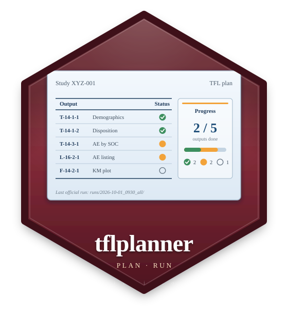

<!-- README.md is written by hand; keep it short and link to the pkgdown site. -->

# tflplanner 

<!-- badges: start -->
[](https://github.com/ichirio/tflplanner/actions/workflows/R-CMD-check.yaml)
[](https://github.com/ichirio/tflplanner/actions/workflows/test-coverage.yaml)
[](https://app.codecov.io/gh/ichirio/tflplanner)
[](https://github.com/ichirio/tflplanner/actions/workflows/pkgdown.yaml)
[](https://lifecycle.r-lib.org/articles/stages.html#experimental)
[](https://www.apache.org/licenses/LICENSE-2.0)
<!-- badges: end -->

`tflplanner` is a 'shiny' study manager for clinical **Tables, Listings
and Figures (TFLs)** made with
[rtfreporter](https://github.com/ichirio/rtfreporter).  Each study is a
folder of its own -- input data, definitions, programs, results and the
records of its official runs -- and the app defines the study's analysis
results data (ARD) and reports, writes their R programs and runs them.

```
Reports  added on screen, or taken in from the company's TOC (xlsx / csv)
ARD      web GUI  =>  (Excel, optional)  =>  ARD programs  =>  the study ARD
         (or an ARD made elsewhere, taken in)
Tables   the study ARD, by output_id  =>  normalize, rework  =>  RTF
Listings, Figures   SDTM / ADaM  =>  report programs  =>  RTF
User code   your own R code makes the content; the report's page wraps it  =>  RTF
Official runs   autoexec_*.R  =>  runs/<date>_<time>_<what>/  (logs, results, code)
```

- **The ARD and the reports are separate steps**, which different people
  can take at different times: a table is made from whatever of the study
  ARD is there.
- **The ARD on screen**: any function of cards / cardx chosen from a list,
  its arguments in a form, analyses run together (`cards::ard_stack()`),
  steps after the ARD (`add_calculated_row()` ...), the study's code lists
  applied before it, the company's own ARD functions, and ARDs made
  elsewhere taken in, checked and compared.
- **Four kinds of report**: tables, listings, figures (a plot designer)
  and user code (your R code makes a table, a figure or both; tflplanner
  adds the page, titles and footnotes).
- **Company standards**: every default and code list the app offers --
  dropdowns, presets, ARD methods and statistics, code templates, the rows
  a new study starts with -- comes from one workbook, set up once.
- **Previews and official runs**: a program run on its own is a preview;
  an official run keeps each program's log ([logrx](https://github.com/pharmaverse/logrx)),
  what it made and the code it ran in a dated batch folder.
- English (default) or Japanese.

> **Status: experimental.**  tflplanner is the GUI over
> [tflspec](https://github.com/ichirio/tflspec) (the specifications and the
> code written from them) and rtfreporter (the ARD and table engine and the
> RTF renderer); its screens and functions may change.

## Concept

- **The code is for people to read and finish.**  The programs tflplanner
  writes are short and plain, close to what a statistical programmer
  writes by hand, and easy to maintain.  Typically, you build
  most of an analysis in the app, copy the program it writes and finish
  it by hand outside the app.
- **The typical analyses and layouts, in a few steps.**  To keep the code
  simple, the app covers the analyses and table layouts most studies use,
  each set with a few simple operations, rather than every possible design.
- **What the screens cannot say is written as R.**  A condition, a derived
  column, an argument, a step after the ARD -- or a whole user-code report
  -- is kept in the spec as R code, and the programs put it where it
  belongs.
- **Shared parts are defined once.**  The header, footer, page style and
  the study's information (company name, analysis type, protocol ID, ...)
  are set once and reused; each report's program carries only its own
  values.
- **Screens => spec => code.**  The app writes the spec (which can also be
  edited directly), and the programs are written from the spec; a
  generated program is not edited inside the tool.

## Installation

Once, at the R console (rtfreporter and tflspec come with it):

```r
install.packages("remotes")
remotes::install_github("ichirio/tflplanner")
```

Without access to GitHub, install the three package files you were given,
in this order:

```r
install.packages(c("rtfreporter_0.8.2.tar.gz", "tflspec_0.0.24.tar.gz",
                   "tflplanner_0.0.2.tar.gz"), repos = NULL, type = "source")
```

R 4.1 or later; analyses that use cardx (e.g. t-tests, confidence intervals) need R 4.2 or later.

## Getting started

```r
tflplanner::setup_tflplanner()
```

asks, step by step, for the three things done at the console -- where
tflplanner keeps its studies (its home), the packages its programs use, and
a shortcut that starts it with a double click (Windows: desktop and Start
menu; macOS: `~/Applications`; Linux: the applications menu).  Everything
else is done in the app.  Without a shortcut, start it with `launch_app()`
(in its own R process; also the RStudio add-in *Launch tflplanner*) or
`run_app()`.

tflplanner never updates itself or anything else on its own.  To update
rtfreporter, tflspec and tflplanner, close the app and run

```r
tflplanner::update_tflplanner()          # the released versions
tflplanner::update_tflplanner("dev")     # the development versions
tflplanner::update_tflplanner(from = "D:/packages")   # from package files
```

or start it from the shortcut **tflplanner (update and launch)**, made
only when asked for: `add_shortcut(update = TRUE)`.  The app can say when
a newer version is out (it looks when it starts): off by default, turned
on in its settings.

The same steps as code, for scripts:

```r
library(tflplanner)
setup_tflplanner(studies_root = "C:/studies",          # once; with the
                 sample = TRUE)                        #   sample study
standards_template("company_standards.xlsx")           # the draft to edit
setup_tflplanner(standards = "company_standards.xlsx") # your standards
add_shortcut(ask = FALSE)
run_app()
```

`sample = TRUE` (or `create_sample_study()`, or *Add the sample study* in
the app's settings) copies the sample study **SAMPLE-01** into the studies
folder and makes it: the CDISC pilot ADaM data of
[pharmaverseadam](https://pharmaverse.github.io/pharmaverseadam/), one
study ARD, five tables, a listing and two figures written as user code
-- a study to try everything on.

A guide in Japanese (provisional):
[tflplanner 利用ガイド（日本語）](https://ichirio.github.io/tflplanner/articles/ja-guide.html).

## Citation

If tflplanner helps your work, please cite it with `citation("tflplanner")`.
The statistics of its tables come from [cards](https://pharmaverse.github.io/cards/)
and [cardx](https://insightsengineering.github.io/cardx/); please cite those
too (`citation("cards")`, `citation("cardx")`).

## Acknowledgments

tflplanner stands on the work of many others, and we are grateful to their
authors.

- **[cards](https://pharmaverse.github.io/cards/) and
  [cardx](https://insightsengineering.github.io/cardx/)**: every ARD program
  the app writes calls them; the analysis results data are their design, an
  outcome of the [pharmaverse](https://pharmaverse.org/) community's work on
  analysis results data.
- **[shiny](https://shiny.posit.co/)**, [bslib](https://rstudio.github.io/bslib/),
  [DT](https://github.com/rstudio/DT),
  [rhandsontable](https://jrowen.github.io/rhandsontable/) and
  [sortable](https://rstudio.github.io/sortable/): the app's screens.
- **[logrx](https://pharmaverse.github.io/logrx/)**: the log of every program
  of an official run.
- **[pharmaverseadam](https://pharmaverse.github.io/pharmaverseadam/)**: the
  ADaM data of the sample study SAMPLE-01 (from the CDISC pilot study,
  Apache License 2.0; copyright Cytel Inc., F. Hoffmann-La Roche AG and
  GlaxoSmithKline LLC -- see `inst/COPYRIGHTS`).

tflplanner is an independent project and is not affiliated with, or endorsed
by, the authors of these packages.

## License

Apache License 2.0.  See [LICENSE.md](LICENSE.md).
