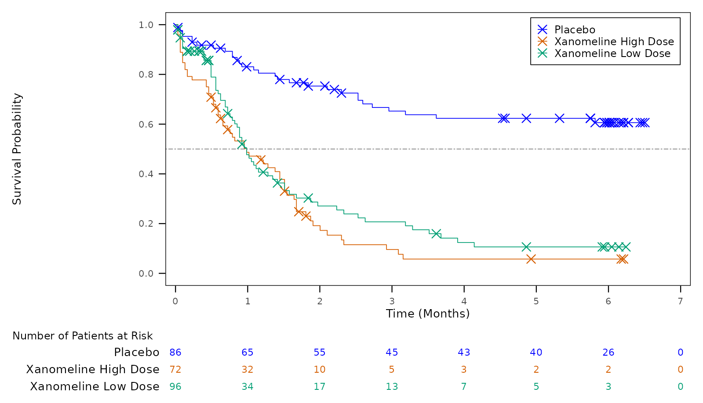
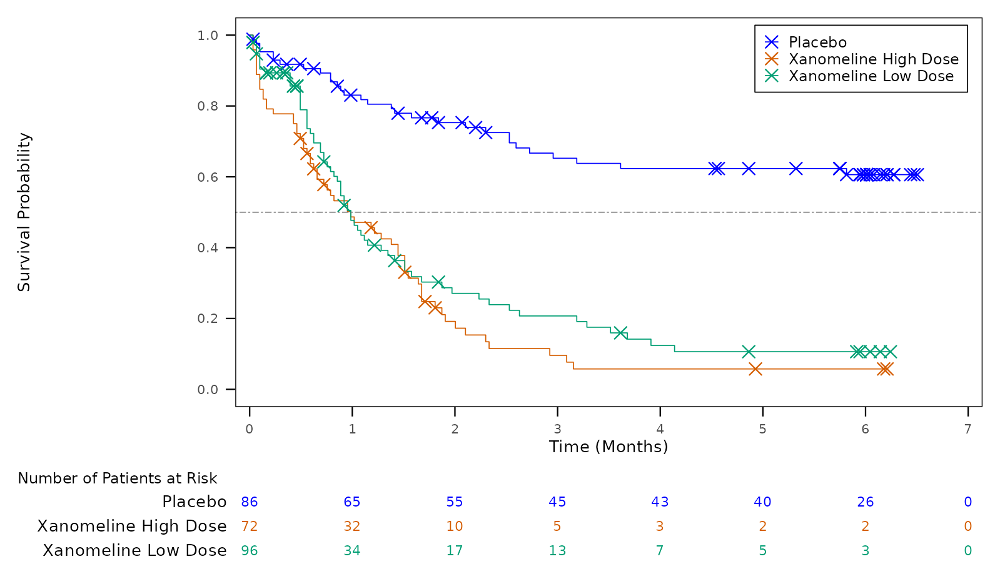
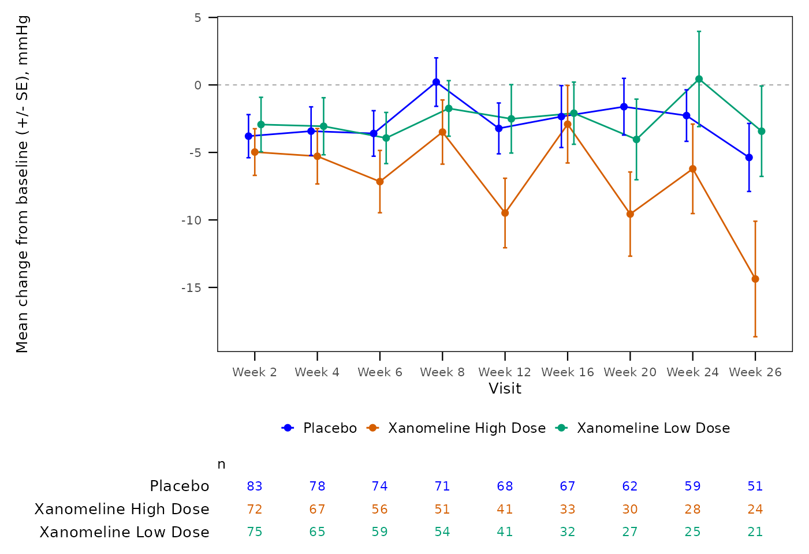
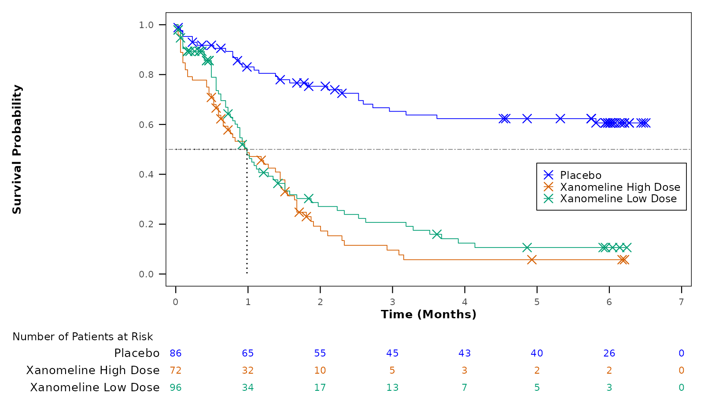

# プロットデザイナーで図を作る（ステップ・バイ・ステップ）

> この記事は tflplanner
> で図（Figure）を作る手順を、サンプル試験を使って一から説明する暫定版の案内です。
> tflplanner と tflspec
> は開発中（experimental）で、画面や関数は変わることがあります。
> tflplanner 全体の使い方は「[tflplanner
> 利用ガイド（日本語）](https://ichirio.github.io/tflplanner/articles/ja-guide.md)」を先に読んでください。

## この記事で作るもの

サンプル試験 **SAMPLE-01**（CDISC パイロット試験の
ADaM、[pharmaverseadam](https://pharmaverse.github.io/pharmaverseadam/)）の
2 つの図を、 プロットデザイナーで作り直します。

| 帳票 | 内容 | 作り方 |
|----|----|----|
| F-14-2-2 | 最初の皮膚関連事象までの時間の Kaplan-Meier プロット（リスク集合数つき） | 3 章：テンプレートから |
| F-14-2-1 | 収縮期血圧のベースラインからの平均変化量の推移 | 4 章：空のデザインから一つずつ |

サンプル試験では、この 2 つの図は R
コードを手で書いた図として入っています。
プロットデザイナーでは同じ図を、**部品を組み合わせたデザイン（図
Spec）** として作ります。

### 図のデザイン（図 Spec）とは

図のデザインは、図を作るための手順を 4
つのパートに分けて並べたものです。 パートの中身は、ひとつひとつ独立した
**部品（ピース）** です。

| パート | 何を書くか | 部品の例 |
|----|----|----|
| `data`（データ加工） | ADaM から図に使う行と列を作る | データセットを読む、PARAMCD を選ぶ、解析対象集団で絞る、ADSL を結合する、時間の単位を変える |
| `stats`（統計量） | データから計算する | Kaplan-Meier 推定、群・来院ごとの平均と SE |
| `plot`（図全体の設定） | 図全体に効く設定 | 軸ラベル、軸の範囲、色の付け方、凡例の位置、図の大きさ |
| `layers`（レイヤー） | 描くものを順に | KM 曲線、打ち切りマーク、線、点、エラーバー、リスク集合数 |

デザインは 1 図 1 つの YAML ファイルとして試験フォルダの
`spec/figures/<帳票ID>.yml` に保存され、
帳票プログラムはそこから生成される ggplot2 のコードで図を描きます。
同じデザインから、画面（プロットデザイナー）でも R（tflspec
の関数）でも同じコードができるので、 この記事では **画面の操作** と
**同じことを R で行うコード** を並べて説明します。 R
のコードはこの記事を作るときに実際に実行しており、図はその結果です。

``` r

library(tflspec)

# サンプル試験の ADaM（tflplanner に同梱）
adam_dir <- system.file("sample/SAMPLE-01/data/adam", package = "tflplanner")
adam <- list(
  ADSL  = readRDS(file.path(adam_dir, "adsl.rds")),
  ADTTE = readRDS(file.path(adam_dir, "adtte.rds")),
  ADVS  = readRDS(file.path(adam_dir, "advs.rds"))
)

# デザインのコードを実行して図を返す（この記事用の小さな関数）
draw <- function(design) {
  code <- tfl_fig_design_code(design, "fig")
  e <- new.env()
  for (n in names(adam)) assign(tolower(n), adam[[n]], envir = e)
  owd <- setwd(tempdir())
  on.exit(setwd(owd))
  suppressMessages(eval(parse(text = code), envir = e))
  e$fig
}
```

## 1. 準備

### 1.1 インストール

tflplanner、tflspec（図のデザインのエンジン）、rtfreporter（RTF
の出力）を GitHub から入れます。 図の描画には
ggplot2、ggsurvfit（KM）、patchwork（パネルの組み合わせ）を使います。

``` r

install.packages("remotes")
remotes::install_github("ichirio/rtfreporter")
remotes::install_github("ichirio/tflspec")
remotes::install_github("ichirio/tflplanner")

install.packages(c("ggplot2", "ggsurvfit", "patchwork", "survival", "dplyr"))
```

### 1.2 サンプル試験を追加して開く

初めて使うときは、ホームと試験フォルダの置き場所を決め、サンプル試験を追加します
（詳しくは利用ガイドの「2. 環境設定」）。

``` r

library(tflplanner)
setup_tflplanner(
  studies_root = "C:/studies",   # 試験フォルダを作る場所
  language     = "ja",           # 画面を日本語に
  sample       = TRUE            # サンプル試験 SAMPLE-01 を追加する
)
run_app("SAMPLE-01")             # サンプル試験を開いてアプリを起動
```

すでに環境がある場合は、アプリの **試験** タブの **設定** にある
**サンプル試験を追加** を押すか、
[`create_sample_study()`](https://ichirio.github.io/tflplanner/reference/create_sample_study.md)
を実行します。
[`run_app()`](https://ichirio.github.io/tflplanner/reference/run_app.md)
を試験を指定せずに起動したときは、**試験** タブで SAMPLE-01
をクリックし、 右の **この試験を開く**
を押します（行のダブルクリックでも開きます）。


試験タブ：SAMPLE-01 を選んだところ

## 2. 図のタブとプロットデザイナーの画面

画面上部のタブのうち、図を作るのは **図** タブです（表は **表**、Listing
は **Listing** タブ）。 **図** タブを開いた状態で左のサイドバーの
**表示する行** から図の帳票（F-14-2-1 や F-14-2-2）を選ぶと、
その図のプロットデザイナーが表示されます。 表や Listing
のタブを開いているときに図の帳票を選ぶと、自動で **図**
タブに切り替わります。

デザインがまだない図（手で書いたコードの図）では、上に
**手書きの図**（その図が読むデータセットと、
帳票プログラムのデータ部分のコード）、下に **デザインを開始**
が出ます（3 章）。

デザインがある図では、画面は 4 つの領域に分かれています。


図のプロットデザイナー（Reports タブ \> Content、F-14-2-2
をテンプレートから開始した直後）

| 場所 | 名前 | 何をするか |
|----|----|----|
| 左 | **デザイン** | 部品の一覧。パートごと（データ加工・統計量・図全体の設定・レイヤー）に並ぶ。部品をクリックして選ぶ、▲▼ で動かす、✕ で削除する。下の選択欄と **追加** で部品を足す。問題のある部品には印が付く |
| 中 | **プレビュー** | 帳票プログラムが保存するのと同じ大きさの PNG（上に保存サイズを表示）。**変更したら再描画** がオンなら変更のたびに描き直される（オフのときは **再描画** で描く）。図の上に **チェックとアドバイス**、下に **チェック** の結果 |
| 右 | **編集** | 左で選んだ部品の項目。空欄は既定値（灰色で表示）。データセット・変数・PARAMCD は試験のデータから選べる。下の **この部品のコード** に、その部品が書き出すコードが出る |
| 下 | **コード** / **デザイン（YAML）** | デザイン全体から生成される R コードと、デザインそのもの（保存される YAML） |

**デザイン** の上のボタン：**他のパラメータへ複製**（同じ図を別の
PARAMCD で作る）、
**プリセットとして保存**（会社の標準の型として残す）、**デザインを削除**（手書きのコードに戻す）。

## 3. テンプレートから作る：KM 曲線 + リスク集合数（F-14-2-2）

### 3.1 画面での操作

1.  **図** タブを開き、サイドバーで **F-14-2-2**
    を選ぶ。デザインがないので **デザインを開始** が出る。
2.  **テンプレートから** を選び、**テンプレート** に「KM 曲線 +
    リスク集合数」を選ぶ。
3.  **データセット** に `ADTTE`
    を選ぶと、そのデータの変数から選べる項目が出る。
    - **パラメータ（PARAMCD）**：`TTDE`
    - **解析対象集団フラグ**：`SAFFL`
    - **群（投与群）**：`TRT01A`
    - **時間の単位**：`months`（ADTTE の `AVAL` は日数。月に変換される）
4.  **デザインを開始する**
    を押す。データ加工・統計量・図全体の設定・レイヤーが一度に埋まり、プレビューに図が描かれる
    （2 章の画面。最初の描画はパッケージの読み込みで数秒かかる）。


デザインを開始：KM 曲線 + リスク集合数のテンプレートに ADTTE
の値を選んだところ

左の **デザイン** には、テンプレートが入れた部品が並びます：
データ加工に「データセットを読む（ADTTE）→ パラメータで絞る（TTDE）→
解析対象集団で絞る（SAFFL）→ 時間の単位を変える（months）」、
統計量に「Kaplan-Meier 推定」、レイヤーに「KM 曲線 → 打ち切りマーク →
水平線 → リスク集合数（下段）」。

### 3.2 同じことを R で

テンプレートは
[`tfl_fig_template()`](https://ichirio.github.io/tflspec/reference/tfl_fig_templates.html)
で、同じ選択をそのまま引数にします。

``` r

km <- tfl_fig_template(
  "km_risk_table",
  data  = "ADTTE",     # データセット
  param = "TTDE",      # パラメータ（PARAMCD）
  pop   = "SAFFL",     # 解析対象集団フラグ
  group = "TRT01A",    # 群
  time_unit = "months" # 時間の単位
)
km
#> template: km_risk_table
#> data:
#> - step: read
#>   dataset: ADTTE
#> - step: param
#>   value: TTDE
#> - step: flag
#>   variable: SAFFL
#> - step: time_unit
#>   variable: AVAL
#>   unit: months
#> stats:
#> - step: survfit
#>   name: fit
#>   time: AVAL
#>   censor: CNSR
#>   by: TRT01A
#> plot:
#>   x_label: Time (Months)
#>   y_label: Survival Probability
#>   colour_by: TRT01A
#>   palette: treatment
#>   legend: inside
#>   x_min: 0.0
#>   y_min: 0.0
#>   y_max: 1.0
#>   y_by: 0.2
#>   width: 8.33
#>   height: 4.79
#>   dpi: 300.0
#>   units: in
#>   base_size: 10.0
#>   theme: boxed
#> layers:
#> - layer: km_curve
#>   linewidth: 0.3
#> - layer: censor_mark
#>   shape: x
#>   size: 3.0
#>   stroke: 0.6
#> - layer: hline
#>   yintercept: 0.5
#>   linetype: twodash
#>   colour: grey50
#>   linewidth: 0.3
#> - layer: risk_table
#>   title: Number of Patients at Risk
#>   size: 3.0
#>   height: 0.167
```

表示されているのがデザイン（YAML）です。画面の **デザイン（YAML）**
と同じ内容です。 `data` の 4 つの部品が「ADTTE を読む → TTDE を選ぶ →
SAFFL = “Y” で絞る → 日を月に」、 `stats` の `survfit` が KM
推定、`layers` が上から順に「KM 曲線 → 打ち切りマーク → 0.5 の水平線 →
リスク集合数」です。

``` r

draw(km)
```



### 3.3 部品を 1 つずつ変える

画面では、左で部品を選び、右の **編集**
で項目を変えます。変えるたびにプレビューが描き直されます。
例として、横軸を 0〜7 か月、1 か月刻みにします。 左で
**図全体の設定**（タイトル・軸・色・凡例・サイズ）を選び、右の **編集**
で「X 最大」に `7`、「X 間隔」に `1` を入れます。

R では、デザインの該当する項目を書き換えるだけです。

``` r

km$plot$x_max <- 7
km$plot$x_by  <- 1
draw(km)
```



リスク集合数の列も 1 か月ごとの目盛りにそろいました。 右下の
**この部品のコード** には、選んだ部品が書き出すコードが表示されます。
たとえば図全体の設定の軸の部分は次のようになります。

``` r

code <- tfl_fig_design_code(km, "F-14-2-2")
cat(grep("x_breaks|scale_x|coord_cartesian", code, value = TRUE), sep = "\n")
#> x_breaks <- seq(0, 7, by = 1)
#>   scale_x_continuous(breaks = x_breaks, expand = expansion(mult = c(0.02, 0.02))) +
#>   coord_cartesian(xlim = range(x_breaks), ylim = c(0, 1)) +
#> sr <- summary(fit, times = x_breaks, extend = TRUE)
#>   scale_x_continuous(breaks = x_breaks, expand = expansion(mult = c(0.02, 0.02))) +
#>   coord_cartesian(xlim = range(x_breaks), clip = "off") +
```

### 3.4 チェックとアドバイス（ワンクリック修正）

プレビューの下の **チェック**
はデザインの誤り（ないデータセットや変数、必須項目の空欄など）、
図の上の **チェックとアドバイス**
は「普通はこうする」という提案（アドバイス）です。 アドバイスのうち、1
つの変更で直せるものには **適用**
ボタンが付き、押すとデザインが直ります。

試しに、左の **レイヤー** で **打ち切りマーク** の ✕
を押して外してみます。 「KM
曲線では通常、打ち切りの位置にマークを付けます。」というアドバイスが
**適用** ボタン付きで出ます （テンプレート直後から出ている「X 最大と X
間隔を設定すると…」は、3.3 で設定した値で消えます）。


打ち切りマークを外したところ：チェックとアドバイスに「適用」が出る

R では
[`tfl_check_fig_design()`](https://ichirio.github.io/tflspec/reference/tfl_fig_design.html)
と
[`tfl_fig_advice()`](https://ichirio.github.io/tflspec/reference/tfl_fig_advice.html)、修正は
[`tfl_fig_apply_fix()`](https://ichirio.github.io/tflspec/reference/tfl_fig_advice.html)
です。

``` r

no_censor <- km
no_censor$layers <- Filter(function(l) l$layer != "censor_mark", no_censor$layers)

tfl_check_fig_design(no_censor, adam)          # 誤りはない（0 行）
#> [1] part    field   problem
#> <0 rows> (or 0-length row.names)
advice <- tfl_fig_advice(no_censor, adam)
advice[, c("rule", "level", "message")]
#>        rule level                                             message
#> 1 km_censor  info KM curves usually mark where subjects are censored.
```

アドバイスの `fix` 列が修正の中身です。画面の **適用**
はこれを実行します。

``` r

fixed <- tfl_fig_apply_fix(no_censor, advice$fix[[which(advice$rule == "km_censor")]])
vapply(fixed$layers, `[[`, "", "layer")
#> [1] "km_curve"    "censor_mark" "hline"       "risk_table"
```

打ち切りマークが KM 曲線のすぐ後に戻りました。

## 4. 一から組み立てる：平均変化量の推移（F-14-2-1）

テンプレートに合う図がないときや、どの部品が何をしているかを確かめたいときは、
**空のデザイン** から部品を 1 つずつ足します。
ここでは収縮期血圧のベースラインからの変化量（ADVS の
`CHG`）の、群・来院ごとの平均 ± SE を描きます。

### 4.1 画面での操作

1.  サイドバーで **F-14-2-1** を選び、**デザインを開始** で
    **テンプレート** の「その他」から **空のデザイン**
    を選んで開始する。
2.  左下の選択欄で部品を選び **追加** を押す。追加した部品を選んで、右の
    **編集** で項目を埋める。
3.  部品を足すごとにプレビューが描き直されるので、途中の状態を見ながら進める。

部品の種類と項目は
[`tfl_fig_parts()`](https://ichirio.github.io/tflspec/reference/tfl_fig_parts.html)
で一覧できます（画面の選択欄と編集欄はこの表から作られています）。

``` r

parts <- tfl_fig_parts()
unique(parts[parts$section == "data", c("piece", "piece_label")])
#>        piece               piece_label
#> 1       read            Read a dataset
#> 2       join            Join variables
#> 6      param          Keep a parameter
#> 8       flag      Keep an analysis set
#> 10    filter     Keep rows (condition)
#> 11    derive         Derive a variable
#> 13 time_unit      Change a time's unit
#> 15    levels Order a variable's values
#> 19      rank                 Rank rows
#> 22 data_code                    R code
parts[parts$piece == "summary", c("field", "kind", "label", "default")]
#>       field      kind                    label default
#> 28     name      text                     Name      sm
#> 29    value  variable                    Value    AVAL
#> 30       by variables                       By    <NA>
#> 31 interval    choice        Interval (lo, hi)      se
#> 32 positive   logical Lower bound only above 0   FALSE
```

### 4.2 データ加工

ADVS を読み、収縮期血圧（`SYSBP`）を選び、群と解析対象集団フラグを ADSL
から結合して、
安全性解析対象集団に絞ります。来院（`AVISIT`）は文字なので、`AVISITN`
の順に並ぶよう水準を付けます。

``` r

mean_fig <- tfl_fig_design(
  data = list(
    list(step = "read",   dataset = "ADVS"),
    list(step = "param",  value = "SYSBP"),
    list(step = "join",   dataset = "ADSL", vars = "TRT01A, SAFFL"),
    list(step = "flag",   variable = "SAFFL"),
    list(step = "filter", expr = "!is.na(CHG) & !is.na(AVISITN)"),
    list(step = "levels", variable = "AVISIT", order_by = "AVISITN")
  )
)
```

### 4.3 統計量

群・来院ごとに `CHG` の平均と SE を計算し、`sm` という名前で残します。
統計量の結果には
`n`、`mean`、`sd`、`se`、`lo`、`hi`（区間の下限・上限）の列ができます。

``` r

mean_fig$stats <- list(
  list(step = "summary", name = "sm", value = "CHG",
       by = "TRT01A, AVISITN, AVISIT", interval = "se")
)
```

### 4.4 図全体の設定

``` r

mean_fig$plot <- list(
  x_label   = "Visit",
  y_label   = "Mean change from baseline (+/- SE), mmHg",
  colour_by = "TRT01A",   # パレットの色を群に
  legend    = "bottom",
  dodge     = 0.3         # 群ごとに少し横にずらす幅
)
```

### 4.5 レイヤー

下から順に重なります：0 の基準線 → 線 → 点 → エラーバー。 `dodge: true`
の部品は、図全体の設定の `dodge` の幅で群ごとにずれます。

``` r

mean_fig$layers <- list(
  list(layer = "hline", yintercept = 0, colour = "grey60"),
  list(layer = "line",     data = "sm", x = "AVISIT", y = "mean", colour = "TRT01A", dodge = TRUE),
  list(layer = "point",    data = "sm", x = "AVISIT", y = "mean", colour = "TRT01A", dodge = TRUE),
  list(layer = "errorbar", data = "sm", x = "AVISIT", colour = "TRT01A", dodge = TRUE)
)
tfl_check_fig_design(mean_fig, adam)
#> [1] part    field   problem
#> <0 rows> (or 0-length row.names)
draw(mean_fig)
```


### 4.6 アドバイスで n の表を足す

平均推移の図には、各来院の例数を図の下に添えるのが普通です。アドバイスがそれを提案し、**適用**（R
では修正）で「来院ごとの n（下段）」のパネルが加わります。

``` r

advice <- tfl_fig_advice(mean_fig, adam)
advice[, c("rule", "message")]
#>     rule
#> 1 mean_n
#>                                                                             message
#> 1 A mean-over-time figure usually shows the n of each group at each visit below it.
mean_fig <- tfl_fig_apply_fix(mean_fig, advice$fix[[which(advice$rule == "mean_n")]])
mean_fig$plot$height <- 5
draw(mean_fig)
```



なお、同じ図は「来院ごとの平均 ±
SE」のテンプレート（`mean_se`）からも一度に作れます。
一から組み立てたデザインも、テンプレートから作ったデザインも、保存されるものは同じ形です。
画面では、組み上がった F-14-2-1
は次のようになります（左のデータ加工に「変数を結合」「条件で絞る」「値の並び順」、
統計量に「要約統計量」、レイヤーの最後に「来院ごとの n（下段）」）。


組み上がった F-14-2-1（平均変化量の推移 + 来院ごとの n）

## 5. カタログにない関数を使う（汎用 call）

部品の一覧（カタログ）にあるのは臨床試験の図でよく使う部品だけです。
それ以外の ggplot2 や拡張パッケージの関数は、**汎用の `call` 部品**
で使えます（tflspec 0.0.21 以降）。

| 書く場所 | 形 | 書かれるコード | 使いどころ |
|----|----|----|----|
| `layers` の `{layer: call, ...}` | `fn`、`package`、`data`、`aes`、`pos`、`args` | `p <- p + fn(data = ..., aes(...), ..., 引数 = ...)` をレイヤーの位置に | カタログにない geom / stat、ggsurvfit の `add_*` |
| `plot` の `add:` | 同じ形（`layer` なし） | 図全体の設定の **後**、パネルの前に | `theme()`、`scale_*()`、`coord_*()`、`facet_*()`、`labs()` |

引数の値は YAML の値がそのまま R
の値になります（数値・文字・`true`/`false`、並びは
[`c()`](https://rdrr.io/r/base/c.html)、 `fn:`
を持つ入れ子は関数呼び出し）。R のコードをそのまま書きたいときは `!r`
を付けます（下の例の `vars(PARAM)` など）。 関数の引数は、書いたときに
[`formals()`](https://rdrr.io/r/base/formals.html)
と照らしてチェックされ、つづりの誤りは候補付きで示されます。

### 5.1 例：KM 図に中央値の線を足し、凡例の位置を変える

ggsurvfit の `add_quantile()`（生存確率 0.5
の点線）をレイヤーに、`theme()` を `plot.add` に書きます。

``` r

km2 <- km
km2$layers <- append(km2$layers, list(list(
  layer = "call", fn = "add_quantile", package = "ggsurvfit",
  args = list(y_value = 0.5, linetype = "dotted")
)), after = 2)
km2$plot$add <- list(list(
  fn = "theme",
  args = list(legend.position.inside = list(0.99, 0.45),
              axis.title = list(fn = "element_text", args = list(face = "bold")))
))
tfl_check_fig_design(km2, adam)
#> [1] part    field   problem
#> <0 rows> (or 0-length row.names)
draw(km2)
```



YAML では次のように書きます。

``` r

# 足した 2 か所だけを YAML で表示
cat(yaml::as.yaml(list(layers = km2$layers[3])),
    yaml::as.yaml(list(plot = list(add = km2$plot$add))), sep = "")
#> layers:
#> - layer: call
#>   fn: add_quantile
#>   package: ggsurvfit
#>   args:
#>     y_value: 0.5
#>     linetype: dotted
#> plot:
#>   add:
#>   - fn: theme
#>     args:
#>       legend.position.inside:
#>       - 0.99
#>       - 0.45
#>       axis.title:
#>         fn: element_text
#>         args:
#>           face: bold
```

### 5.2 例：`!r` で R の式を書く

`!r` を付けた値は、引用符を付けずにそのままコードに書かれます。
関数（[`scales::label_number()`](https://scales.r-lib.org/reference/label_number.html)）、`vars()`、`NA`
などに使います。

``` r

yaml_text <- '
fn: scale_x_discrete
args:
  labels: !r function(x) sub("Week ", "W", x)
'
spec <- yaml::yaml.load(yaml_text, handlers = list(r = tfl_fig_r))
mean_fig2 <- mean_fig
mean_fig2$plot$add <- list(spec)
cat(grep("scale_x_discrete", tfl_fig_design_code(mean_fig2), value = TRUE), sep = "\n")
#> p <- p + scale_x_discrete(labels = function(x) sub("Week ", "W", x))
```

### 5.3 画面でどこまで、YAML でどこから

| やりたいこと | 画面（プロットデザイナー） | YAML / R |
|----|----|----|
| カタログの部品を足す・変える・並べ替える | できる | できる |
| `call` レイヤーの関数名・パッケージ・データ | 左の **追加** で「call」を足し、右で入力 | できる |
| `call` の `aes` / `args`（名前付きの値の組）、入れ子の関数、`!r` | 画面では表示・確認まで | **YAML か R で書く** |
| `plot.add`（theme / scale / facet など） | 画面では表示・確認まで | **YAML か R で書く** |
| 生成されるコードとチェック結果の確認 | できる（下の **コード**、中の **チェック**） | [`tfl_fig_design_code()`](https://ichirio.github.io/tflspec/reference/tfl_fig_design.html)、[`tfl_check_fig_design()`](https://ichirio.github.io/tflspec/reference/tfl_fig_design.html) |

YAML や R で書いたデザインを試験に取り込む方法は 6.3 節です。

拡張パッケージのよく使う関数（ggh4x の `facet_nested()`、ggtext の
`element_markdown()`、 ggforce の `facet_zoom()`、ggnewscale の
`new_scale_colour()` など）は
[`tfl_fig_calls()`](https://ichirio.github.io/tflspec/reference/tfl_fig_calls.html)
に一覧があり、 これらは `package:`
を書かなくても使えます（生成コードでは `パッケージ::関数`
の形になり、必要なパッケージがコメントに出ます）。

``` r

tfl_fig_calls()[, c("package", "fn", "where", "label")]
#>      package                     fn    where                   label
#> 1      ggh4x           facet_nested plot.add           Nested facets
#> 2      ggh4x      facet_nested_wrap plot.add Nested facets (wrapped)
#> 3      ggh4x    facetted_pos_scales plot.add        Per-panel scales
#> 4     ggtext       element_markdown   nested           Markdown text
#> 5     ggtext element_textbox_simple   nested       Markdown text box
#> 6    ggforce             facet_zoom plot.add            Zoomed panel
#> 7 ggnewscale       new_scale_colour   layers        New colour scale
#> 8 ggnewscale         new_scale_fill   layers          New fill scale
#> 9 ggnewscale              new_scale   layers               New scale
```

## 6. YAML の図 Spec を書き出す・読み込む

### 6.1 書き出す・読み込む

デザインは
[`tfl_write_fig_design()`](https://ichirio.github.io/tflspec/reference/tfl_fig_design.html)
で YAML
に書き出し、[`tfl_read_fig_design()`](https://ichirio.github.io/tflspec/reference/tfl_fig_design.html)
で読み込みます。 試験では保存のたびに `spec/figures/<帳票ID>.yml`
に書き出されるので、ファイルの差分でレビューできます。

``` r

f <- tempfile(fileext = ".yml")
tfl_write_fig_design(mean_fig, f)
back <- tfl_read_fig_design(f)
identical(tfl_fig_design_code(back), tfl_fig_design_code(mean_fig))
#> [1] TRUE
```

### 6.2 YAML から R コードを作る

[`tfl_fig_design_code()`](https://ichirio.github.io/tflspec/reference/tfl_fig_design.html)
が、デザインから ggplot2 のプログラムを作ります。
帳票プログラムの図の部分はこのコードです（Step1：データの準備、Step2：図、Step3：PNG
の保存）。

``` r

code <- tfl_fig_design_code(mean_fig, "F-14-2-1")
cat(head(code, 40), sep = "\n")
#> # F-14-2-1: figure design
#> # Generated by tflspec 0.0.24.9022 from the figure's design.
#> 
#> library(dplyr)
#> library(ggplot2)
#> library(patchwork)
#> 
#> #########################################################
#> # Step1: Preparing Analysis Data
#> #########################################################
#> # Input data frames: advs, adsl
#> 
#> df <- advs %>%
#>   filter(PARAMCD == "SYSBP") %>%
#>   left_join(
#>     adsl %>% select(USUBJID, TRT01A, SAFFL),
#>     by = "USUBJID"
#>   ) %>%
#>   filter(SAFFL == "Y") %>%
#>   filter(!is.na(CHG) & !is.na(AVISITN)) %>%
#>   mutate(AVISIT = reorder(factor(AVISIT), AVISITN))
#> 
#> sm <- df %>%
#>   filter(!is.na(CHG)) %>%
#>   group_by(TRT01A, AVISITN, AVISIT) %>%
#>   summarise(n = n(), mean = mean(CHG), sd = sd(CHG), .groups = "drop") %>%
#>   mutate(se = sd / sqrt(n), lo = mean - se, hi = mean + se)
#> 
#> # the treatment palette, a colour for each TRT01A
#> pal_lv <- if (is.factor(df$TRT01A)) levels(droplevels(df$TRT01A)) else sort(unique(as.character(df$TRT01A)))
#> pal <- setNames(c("blue", "#D55E00", "#009E73", "#CC79A7", "#E69F00", "#56B4E9")[seq_along(pal_lv)], pal_lv)
#> 
#> pd <- position_dodge(width = 0.3)
#> 
#> #########################################################
#> # Step2: Making a figure
#> #########################################################
#> p <- ggplot()
#> # ---- layer 1: Horizontal lines ----
#> p <- p + geom_hline(yintercept = 0, linetype = "dashed", colour = "grey60", linewidth = 0.3)
```

### 6.3 R や YAML で作ったデザインを試験に入れる

YAML
ファイルを直接編集してもよいですが、正（マスター）はアプリが保持する試験の状態です。
R で作ったデザインは
[`set_fig_design()`](https://ichirio.github.io/tflplanner/reference/fig_design.md)
で帳票に設定し、[`save_study()`](https://ichirio.github.io/tflplanner/reference/save_study.md)
で保存します。 保存すると `spec/figures/` の YAML
と帳票プログラムが書き直され、アプリで開くとプロットデザイナーに表示されます。

``` r

library(tflplanner)
st <- open_study("SAMPLE-01")
design <- tflspec::tfl_read_fig_design("my-km.yml")   # 編集した YAML
st$planner <- set_fig_design(st$planner, "F-14-2-2", design)
save_study(st)
```

### 6.4 チェックとアドバイスのまとめ

| 関数 | 何を返すか | 画面では |
|----|----|----|
| `tfl_check_fig_design(design, adam)` | 誤り（`part`、`field`、`problem`）。0 行なら問題なし | プレビューの下の **チェック**、左の部品の印 |
| `tfl_fig_advice(design, adam)` | 提案（`rule`、`level`、`message`、`fix`） | 図の上の **チェックとアドバイス** と **適用** |
| `tfl_fig_apply_fix(design, fix)` | 修正後のデザイン | **適用** ボタン |

`adam` を渡すと、データセット・変数・PARAMCD
がデータにあるかまで確かめます（渡さなければ形だけのチェック）。

## 7. ggplot2 のバージョン（3.5 / 4.0）

ggplot2 は 4.0 で一部の関数や引数が変わりました。 図のデザインは
**ggplot2 3.5 系と 4.0 系** のどちらかに向けてコードを書けます。
対象は次の順で決まります：関数の引数 `ggplot2_version =` →
デザインの先頭の `ggplot2_version:` → オプション
`tflspec.ggplot2_version` → インストールされている ggplot2。

``` r

# 試験全体を 3.5 に固定する（たとえば .Rprofile や autoexec で）
options(tflspec.ggplot2_version = "3.5")
```

違いの一覧は
[`tfl_fig_compat()`](https://ichirio.github.io/tflspec/reference/tfl_fig_compat.html)
です。バージョンを渡すと、その版での扱い（`status`）が付きます。

``` r

cp <- tfl_fig_compat("3.5")
head(cp[cp$status == "absent", c("fn", "arg", "from")], 8)
#>                 fn       arg  from
#> 4     element_geom      <NA> 4.0.0
#> 5    element_point      <NA> 4.0.0
#> 6  element_polygon      <NA> 4.0.0
#> 7      stat_manual      <NA> 4.0.0
#> 8     stat_connect      <NA> 4.0.0
#> 9            theme      geom 4.0.0
#> 10           theme palette.* 4.0.0
#> 11         theme_*       ink 4.0.0
```

どう効くか：

- **名前が変わったもの**（`geom_label()` の `label.size` ↔︎
  `linewidth`、`coord_trans()` ↔︎ `coord_transform()` など）は、
  対象の版の名前で自動的に書かれ、行末にコメントが付きます。
- **対象の版にないもの**（3.5 での `coord_cartesian(reverse =)` など）は
  [`tfl_check_fig_design()`](https://ichirio.github.io/tflspec/reference/tfl_fig_design.html)
  のエラーになります。
- **非推奨のもの**（線の `size =` → `linewidth =` など）は
  [`tfl_fig_advice()`](https://ichirio.github.io/tflspec/reference/tfl_fig_advice.html)
  の警告になり、**適用** で直せます。
- 4.0
  にしかない機能を使ったときだけ、コードの先頭に版の確認（`stopifnot(...)`）が入ります。
  対象を明示したときはヘッダーに `# Written for ggplot2 4.0`
  などと書かれます。

``` r

lab <- list(layer = "call", fn = "geom_label", data = "sm",
            aes = list(x = "AVISIT", y = "hi", label = "n"),
            args = list(label.size = 0.2))
d <- mean_fig
d$layers <- c(d$layers, list(lab))
code40 <- tfl_fig_design_code(d, "F-14-2-1", ggplot2_version = "4.0")
cat(grep("Written for|stopifnot|geom_label\\(", code40, value = TRUE), sep = "\n")
#> # Written for ggplot2 4.0
#> # needs ggplot2 >= 4.0.0: geom_label(linewidth =)
#> stopifnot(utils::packageVersion("ggplot2") >= "4.0.0")
#> p <- p + geom_label(data = sm, aes(x = AVISIT, y = hi, label = n), linewidth = 0.2)   # ggplot2 4.0: label.size -> linewidth
code35 <- tfl_fig_design_code(d, "F-14-2-1", ggplot2_version = "3.5")
cat(grep("geom_label\\(", code35, value = TRUE), sep = "\n")
#> p <- p + geom_label(data = sm, aes(x = AVISIT, y = hi, label = n), label.size = 0.2)
```

``` r

d <- mean_fig
d$plot$add <- list(list(fn = "coord_cartesian", args = list(reverse = "y")))
tfl_check_fig_design(d, ggplot2_version = "3.5")
#>          part        field
#> 1 plot.add[1] args$reverse
#>                                                                             problem
#> 1 ggplot2 3.5: coord_cartesian(reverse =) is not available (added in ggplot2 4.0.0)
```

もう 1 つ、4.0 では **列の `label` 属性**（ADaM
の変数ラベル）が、軸や凡例のタイトルが未設定のときに使われます。
軸ラベルを空欄にしている図は、3.5 では変数名（例：`TRT01A`）、4.0
ではラベル（例：`Actual Treatment for Period 01`）が表示されます。 4.0
向けのデザインでこうなる軸があると、アドバイスが知らせます。

## 8. 保存・プログラムの実行・RTF の確認

1.  画面右上の **保存** で試験を保存します。デザインは
    `spec/figures/<帳票ID>.yml` に書き出され、 帳票プログラム
    `programs/tfl/<帳票ID>.R` の図の部分がデザインから作り直されます
    （図の部分には「デザインをプロットデザイナーで編集し、このコードは直接編集しない」旨のコメントが入ります）。
2.  **帳票** タブで帳票を選んで **選択した帳票を実行**
    を押すと、プログラムが試験フォルダで実行され、
    `output/tfl/<帳票ID>.rtf` ができます。ログは **実行ログ**
    で確認できます。
3.  正式実行（`autoexec_*.R`）では、実行内容が `runs/<日時>_<内容>/`
    にログ・結果・コードごと残ります（利用ガイドの 9 章）。

R では次のとおりです。

``` r

library(tflplanner)
st <- open_study("SAMPLE-01")
st$planner <- set_fig_design(st$planner, "F-14-2-2", km)
save_study(st)                         # spec/figures/F-14-2-2.yml と programs/tfl/F-14-2-2.R
pv <- preview_figure(st, "F-14-2-2")   # プレビューと同じ：PNG、チェック、アドバイス
pv$png
run_study(st, "F-14-2-2")              # output/tfl/F-14-2-2.rtf
```

## 9. 困ったとき

チェックでよく出るエラーと直し方です。表の「例」は
[`tfl_check_fig_design()`](https://ichirio.github.io/tflspec/reference/tfl_fig_design.html)
が実際に返す文言です。

| 症状 | 例 | 直し方 |
|----|----|----|
| PARAMCD がデータにない | `no PARAMCD OS` | パラメータの部品で、データにある値を選ぶ（選択欄はデータから作られる） |
| 変数がデータにない | `no variable TRTA in df` | 変数名を確認する。結合（`join`）や導出（`derive`）で作る列は、その部品より後でしか使えない |
| 関数の引数のつづり | `'sise' is not a parameter of geom_text() (did you mean size, lineheight, parse?)` | 候補（did you mean …）の名前に直す |
| 図全体の関数を layers に書いた | `'theme' is a figure-wide function; use plot.add instead of layers` | `theme` / `scale_*` / `coord_*` / `facet_*` / `labs` は `plot.add` に書く |
| 設定が二重 | `overrides plot$facet_by (a facet_* is also in plot.add)` | 図全体の設定（`facet_by` など）と `plot.add` の同じ種類の関数は、どちらか一方にする |
| ggsurvfit の `add_*` の前提 | `add_quantile() needs the KM curves layer (km_curve)` | 先に KM 曲線のレイヤーを置く |
| リスク集合数が二重 | `the number at risk twice: ...` | `add_risktable()` か、リスク集合数のレイヤー（`risk_table`）のどちらか一方にする |
| ggplot2 の版にない機能 | `ggplot2 3.5: coord_cartesian(reverse =) is not available (added in ggplot2 4.0.0)` | 対象の版を 4.0 にするか、その機能を使わない（7 章） |

プレビューが描けないとき（エラー）は、プレビューの下にエラーの文言が出ます。
下の **コード** を R にコピーして 1
行ずつ実行すると、どこで止まるかを確かめられます。 チェックが 0
件でも図がおかしいときは、**この部品のコード**
で各部品が書き出すコードを見比べてください。
