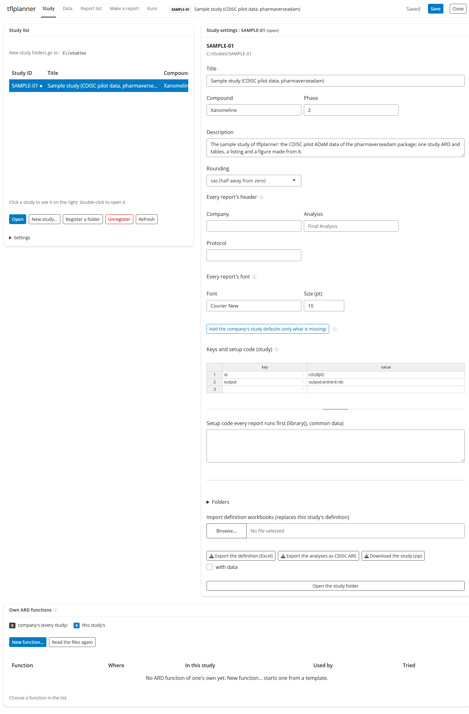
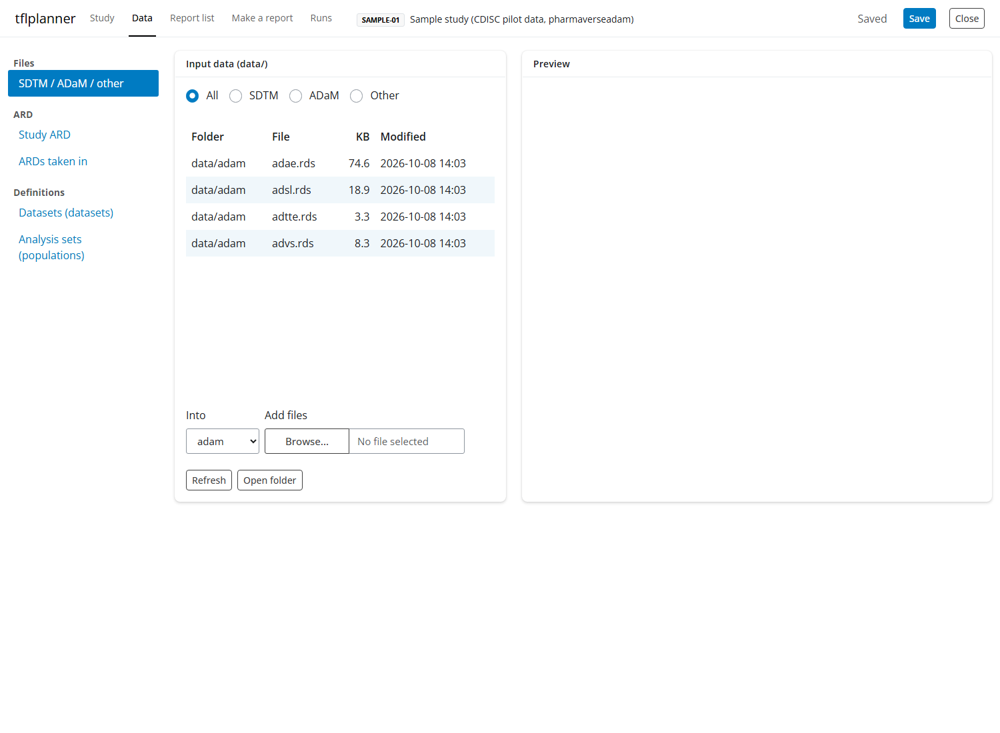
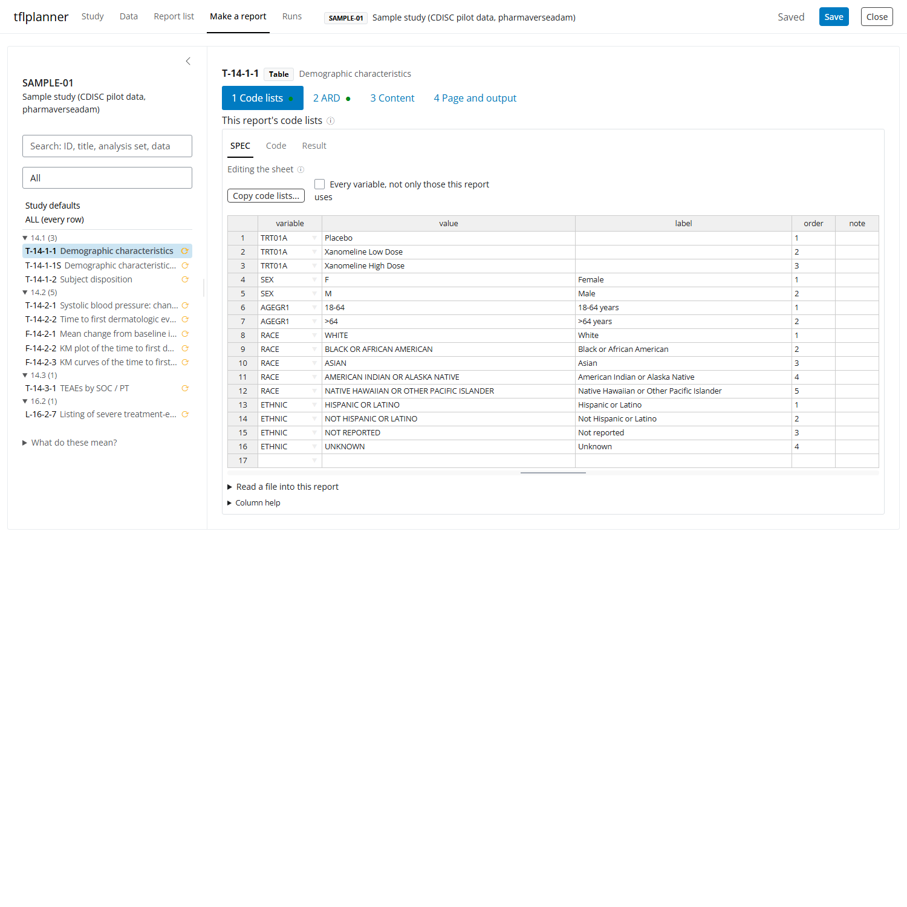
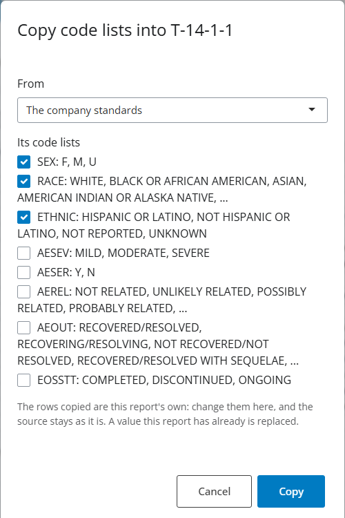

```{r, include = FALSE}
knitr::opts_chunk$set(eval = FALSE, collapse = TRUE, comment = "#>")
```

> tflplanner is experimental: its screens and functions may change.  The
> pictures here are of the sample study **SAMPLE-01** (the CDISC pilot ADaM
> data of [pharmaverseadam](https://pharmaverse.github.io/pharmaverseadam/)),
> which `setup_tflplanner(sample = TRUE)` or *Add the sample study* (the
> study tab's settings) makes for you.  A guide in Japanese, with the
> details of each sheet and function: [tflplanner 利用ガイド](ja-guide.html).

tflplanner is a study manager for clinical tables, listings and figures.
A study is one folder: its data, its definitions, the programs tflplanner
writes from them, their results and the records of the official runs.
The app has five tabs: **Study** (the studies, one open at a time), **Data**
(the study's files, its study ARD, its datasets and analysis sets),
**Report list** (the reports, added here or taken in from the company's
TOC), **Make a report** (one report at a time, in four steps) and **Runs**
(previews and the official runs).

The idea behind every screen: *screens write the spec, the spec writes
the code*.  What you set on a form goes into the study's definition
(sheets you can also edit directly, and export to Excel); the programs are
written from the definition and are not edited in the tool; what a form
cannot say is written as R in the definition, and the programs put it
where it belongs.

## The study tab



The list on the left is the registered studies; a click shows one on the
right, a double click opens it.  *New study* makes a folder (or copies the
sample); *Register a folder* takes in a study made elsewhere; *Unregister*
takes a study off the list without touching its folder.

The settings of the open study are on the right, and the things every
report shares are set here once:

- **Every report's header**: the company, the analysis and the protocol
  the running header prints (`{COMPANY}`, `{ANALYSIS_TYPE}`,
  `{STUDY_ID}`).  Each report's program then carries only its own words
  (its label, title and analysis set).
- **Every report's font**: the font and size (in points) every report is
  written in.  Blank, it is rtfreporter's (Courier, 9 pt); the company
  standards give a new study theirs.  A report may have its own (step 4).
- **Add the company's study defaults** fills in what a study made without
  them is missing: the table look, headers and footers, the font, the
  analysis sets and the datasets.

The settings under the list (*Settings*) are the app's: where new study
folders go, the language, the company standards workbook, and the sample
study.

## The data tab



*Files* lists the study's input data (`data/adam/`, `data/sdtm/`,
`data/other/`); *Add files* copies files in, and a file added here goes
into the study's datasets.  *ARD* shows the study ARD as it stands (every
report's rows, with any errors of its analyses first) and the ARDs taken
in from elsewhere.  *Definitions* holds what every report of the study
reads: the **datasets** (name, level and file) and the **analysis sets**
(`SAF`, `ITT` ...: the subjects a percent is of, each a condition on
ADSL).

## Make a report: four steps

Choose a report above (or in the list on the left: `>` opens it).  The
four steps are the report's code lists, its ARD, its content and its
page.  Each step's right side is **SPEC | Code | Result**: the sheets the
form writes, the program written from them, and what it makes.

### Step 1: this report's code lists



A code list is a variable's values, their order and the text they print
as.  It is **the report's**: *Copy code lists...* takes the lists this
report needs from the company standards or from another report (the rows
copied are then this report's own, and the source stays as it is); a
file can be read into the report; and the rows are changed here.



The ARD uses the lists of the variables its analyses read -- the ARD
program makes those columns factors in the list's order, so the ARD keeps
the order and counts a value no record has as 0 -- and the table uses
them all, for the order of its rows and the words they print.  A report
that needs none skips this step.

### Step 2: the ARD

The ARD (analysis results data, the design of [cards](https://pharmaverse.github.io/cards/))
is the data a table is made from, and tflplanner defines it per report:
the report's analysis set at the top, then **2-1 the analysis data** the
analyses run on and **2-2 the analyses** themselves.  Saving writes the
report's ARD program (`programs/ard/<output_id>.R`); *Preview* runs it
and shows the ARD.


An analysis data is made from a dataset: kept to the report's analysis
set, filtered by a condition (built from the variables' values, or
written as R), and with columns it makes.  **Columns made** are built by
kind: a split by conditions (`ifelse()` / `dplyr::case_when()`), a number
cut into groups (`cut()`), the days between two dates, or any R.  The
sheet keeps the R as written; the form reads these four kinds back and
leaves any other expression as it is.  *Levels and order (code lists)...*
opens the code lists of the columns the data makes.  An analysis data is
the report's: *Copy from another report...* brings one over.


An analysis is one call of a cards / cardx function: its method (any
function of the two packages, chosen from a list with a description), its
data (an analysis data of 2-1), its groups and variables, its statistics
and their formats, its arguments and a step after the ARD (`post`).
Analyses of the same data and groups can run together as one
`cards::ard_stack()` call (*Run together with other analyses*); what a
form cannot say is *Write this analysis as code*.  The study's statistics
(CV, SE, geometric means, confidence intervals ...) come from the company
standards; a statistic cards does not have is a function tflplanner writes
into the program.

### Step 3: the content

For a table, step 3 is the **table builder** and the table's sheets
(tables, variables, codelists, cells, layout, columns, style,
col_header): the columns and their order, the column header, the rows
(variables in order, with their labels) and the statistics.


**Statistics**: whether the table prints the ARD's numbers rounded here or
the ARD's text as step 2 formatted it; a continuous variable's rows,
chosen and ordered by dragging (the company standards' rows, single
statistics, or a row of your own); the **decimals of each statistic**,
and a variable's exceptions; a categorical variable's format and the
decimals of its percent.  The table on the right is the first page as it
will print, made from the study ARD.

A listing's step 3 is its dataset, condition, order and columns; a
figure's is the plot designer ([in Japanese](ja-figures.html)); a
user-code report's is the data it reads and your R code.

### Step 4: the page and the output


The report's page: its titles and footnotes, its own header or footer
when it needs one, tokens of its own, and -- at the top -- **this
report's font and size**.  Blank, they are every report's (the study
tab's), shown greyed; a value is this report's own.  The Code tab is the
report's program as it will be written; the Result tab is the first page
of the report.

## The report list and the runs


The report list is every report of the study with its section, type,
program, output file and data.  *Take in a TOC...* reads the company's TOC
(Excel / CSV) and makes the list, titles and footnotes at once, and keeps
hand-made changes when the TOC is taken in again.


The runs tab shows each report's state (made, out of date, error), runs
previews, and starts the **official run**: every program in its own R
process from the study folder, each log kept
([logrx](https://pharmaverse.github.io/logrx/)), the results and the code
that ran in a dated batch folder `runs/<date>_<time>_<what>/`.

## The same from R

Everything the app does is a function, for scripts and for the console:

```{r}
library(tflplanner)
s <- open_study("ABC-101")
s$planner <- set_study_page_value(s$planner, "font", "Courier New")
s$planner <- set_analysis_data(s$planner, "T-14-2-1", "advs_w24", from = "ADVS",
  where = 'PARAMCD == "SYSBP" & AVISIT == "Week 24"',
  derive = 'AGEGRP = cut(AGE, c(-Inf, 65, 75, Inf), c("<65", "65-74", ">=75"), right = FALSE)')
save_study(s)                       # writes the programs again
run_batch(s, c("ard", "tfl"))       # the official run
```
