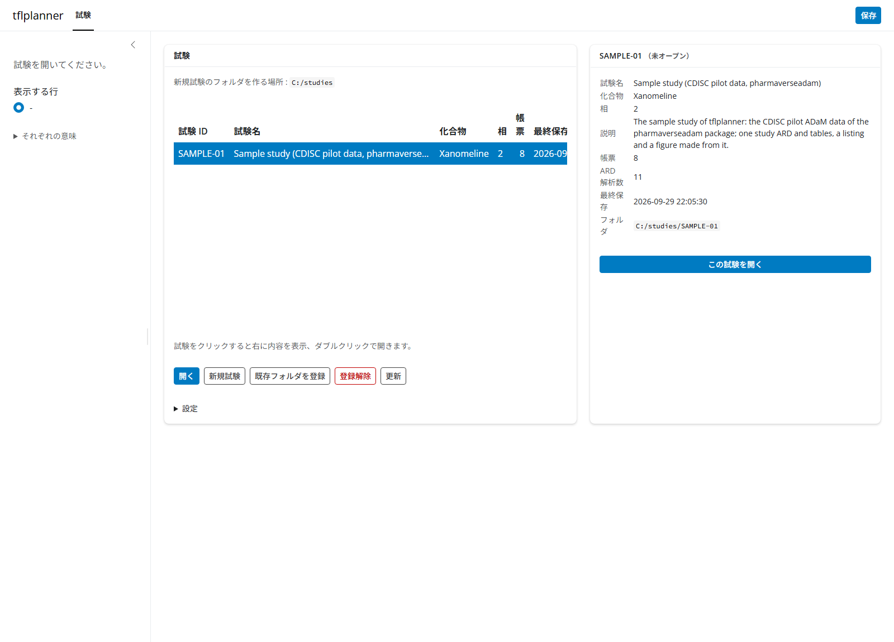
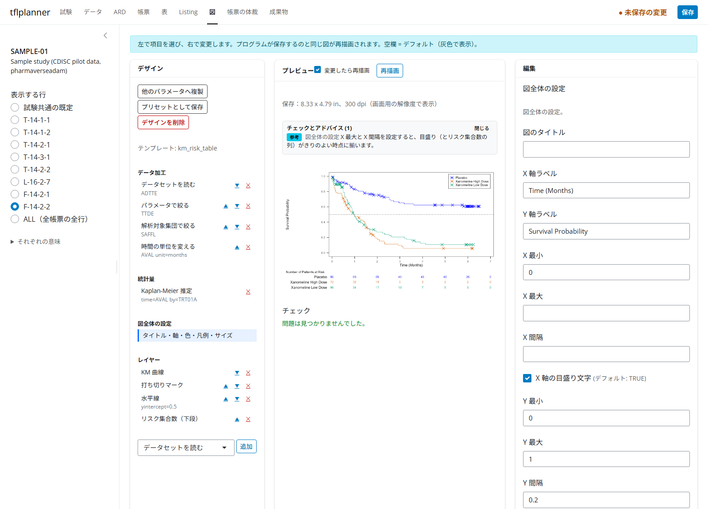
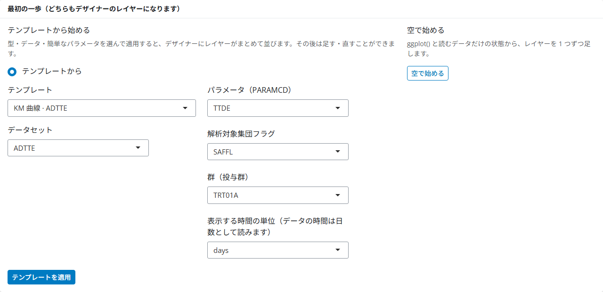
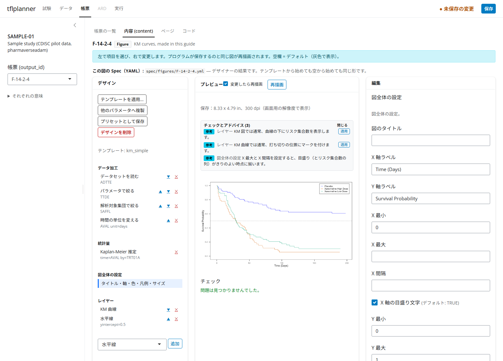
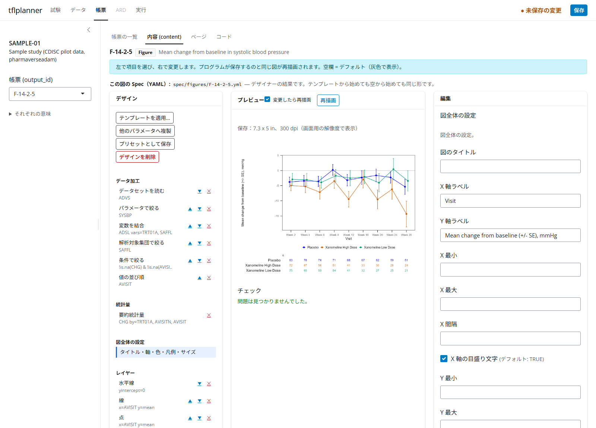

```{r, include = FALSE}
knitr::opts_chunk$set(collapse = TRUE, comment = "#>", fig.align = "center",
                      out.width = "100%", dpi = 96)
# the packages the generated code attaches, attached here quietly first
suppressWarnings(suppressPackageStartupMessages({
  library(dplyr); library(ggplot2); library(ggsurvfit); library(patchwork)
}))
```

> この記事は tflplanner で図（Figure）を作る手順を、サンプル試験を使って一から説明する暫定版の案内です。
> tflplanner と tflspec は開発中（experimental）で、画面や関数は変わることがあります。
> tflplanner 全体の使い方は「[tflplanner 利用ガイド（日本語）](ja-guide.html)」を先に読んでください。

## この記事で作るもの

tflplanner の図の作り方は 3 つあります。この記事はこの順に進みます。

| 作り方 | どんなときに | この記事 | サンプル試験の見本 |
|---|---|---|---|
| **テンプレートから**始め、デザイナーで足す・直す | よくある図（KM、平均の推移、Waterfall など） | 3 章：F-14-2-4 を作る | **F-14-2-3**（KM 曲線、中央値の破線つき） |
| **空から**デザイナーで部品を 1 つずつ組む | 合うテンプレートが無いとき、部品の働きを確かめたいとき | 4 章：F-14-2-5 を作る | ― |
| **ユーザーコード**（ggplot を自分で書く） | デザイナーで書けない図、既存のプログラムを持ち込むとき | 5 章 | **F-14-2-1**、**F-14-2-2** |

使うのはサンプル試験 **SAMPLE-01**（CDISC パイロット試験の ADaM、[pharmaverseadam](https://pharmaverse.github.io/pharmaverseadam/)）です。
3 章では、サンプルの F-14-2-3 と同じ図を、新しい帳票 F-14-2-4 として自分で作ります。
できあがったら、2 つのデザインが同じになることを確かめます（3.3 節）。

### 図のデザイン（図 Spec）とは

テンプレートから始めても空から始めても、デザイナーで作った図は **部品を組み合わせたデザイン（図 Spec）** になります。
図のデザインは、図を作るための手順を 3 つのパートに分けて並べたものです。
パートの中身は、ひとつひとつ独立した **部品（ピース）** です。

| パート | 何を書くか | 部品の例 |
|---|---|---|
| `data`（データ加工） | ADaM から図に使う行と列を作り、そこから計算する（上から順に） | データセットを読む、PARAMCD を選ぶ、解析対象集団で絞る、ADSL を結合する、時間の単位を変える、Kaplan-Meier 推定、群・来院ごとの平均と SE |
| `plot`（図全体の設定） | 図全体に効く設定 | 軸ラベル、軸の範囲、色の付け方、凡例の位置、図の大きさ |
| `layers`（レイヤー） | 描くものを順に | KM 曲線、打ち切りマーク、線、点、エラーバー、水平線、リスク集合数 |

データ加工の部品のうち、Kaplan-Meier 推定（`fit`）や要約統計量（`sm`）のように **自分のオブジェクトを作る部品** があります。
その後ろの部品は、そのオブジェクトの加工として続きます（たとえば要約統計量の後ろの「変数を作る」は `sm` に列を足します）。
帳票プログラムでは、データ加工が `# ---- data ----`、図の組み立てが `# ---- plot ----` の節になり、
図は `plot <- ggplot(...) + ...` のひとつながりの式で書かれます。

デザインは 1 図 1 つの YAML ファイルとして試験フォルダの `spec/figures/<帳票ID>.yml` に保存され、
帳票プログラムはそこから生成される ggplot2 のコードで図を描きます。
同じデザインから、画面（プロットデザイナー）でも R（tflspec の関数）でも同じコードができるので、
この記事では **画面の操作** と **同じことを R で行うコード** を並べて説明します。
R のコードはこの記事を作るときに実際に実行しており、図はその結果です。

```{r setup, message = FALSE}
library(tflspec)

# サンプル試験の ADaM（tflplanner に同梱）
adam_dir <- system.file("sample/SAMPLE-01/data/adam", package = "tflplanner")
adam <- list(
  ADSL  = readRDS(file.path(adam_dir, "adsl.rds")),
  ADTTE = readRDS(file.path(adam_dir, "adtte.rds")),
  ADVS  = readRDS(file.path(adam_dir, "advs.rds"))
)

# デザインのコードを実行して図を返す（この記事用の小さな関数）
draw <- function(design) {
  code <- tfl_fig_design_code(design, "fig")
  e <- new.env()
  for (n in names(adam)) assign(tolower(n), adam[[n]], envir = e)
  owd <- setwd(tempdir())
  on.exit(setwd(owd))
  suppressMessages(eval(parse(text = code), envir = e))
  e$fig
}
```

## 1. 準備

### 1.1 インストール

tflplanner、tflspec（図のデザインのエンジン）、rtfreporter（RTF の出力）を GitHub から入れます。
図の描画には ggplot2、ggsurvfit（KM）、patchwork（パネルの組み合わせ）を使います。

```{r, eval = FALSE}
install.packages("remotes")
remotes::install_github("ichirio/rtfreporter")
remotes::install_github("ichirio/tflspec")
remotes::install_github("ichirio/tflplanner")

install.packages(c("ggplot2", "ggsurvfit", "patchwork", "survival", "dplyr"))
```

### 1.2 サンプル試験を追加して開く

初めて使うときは、ホームと試験フォルダの置き場所を決め、サンプル試験を追加します
（詳しくは利用ガイドの「2. 環境設定」）。

```{r, eval = FALSE}
library(tflplanner)
setup_tflplanner(
  studies_root = "C:/studies",   # 試験フォルダを作る場所
  language     = "ja",           # 画面を日本語に
  sample       = TRUE            # サンプル試験 SAMPLE-01 を追加する
)
run_app("SAMPLE-01")             # サンプル試験を開いてアプリを起動
```

すでに環境がある場合は、アプリの **試験** タブの **設定** にある **サンプル試験を追加** を押すか、
`create_sample_study()` を実行します。
`run_app()` を試験を指定せずに起動したときは、**試験** タブで SAMPLE-01 をクリックし、
下の **開く** を押します（行のダブルクリックでも開きます）。



## 2. 図の帳票を足す・プロットデザイナーの画面

### 2.1 図の帳票を足す

図は、表や Listing と同じく **帳票** タブで作ります。

1. **帳票** タブの **帳票の一覧** で、下の **追加** を押す。
2. **output_id** に `F-14-2-4`、**種別** に **Figure** を選び、**説明** に「KM curves, made in this guide」などと書いて **OK** を押す。
3. **内容 (content)** に切り替わり、「新しい図です」と **最初の一歩** が出る。

**最初の一歩** には 2 つの始め方があります。どちらで始めても、できるのは同じ形のデザイン（デザイナーのレイヤー）です。

| 始め方 | 何が起きるか |
|---|---|
| **テンプレートから始める** | 型・データ・簡単なパラメータを選んで **テンプレートを適用** を押すと、データ加工・図全体の設定・レイヤーが一度に入る（3 章） |
| **空で始める** | `ggplot()` と読むデータだけの状態から、部品を 1 つずつ足す（4 章） |

その下の **ユーザーコード（ggplot を自分で書く）** を開くと、デザイナーを使わずにコードを書く図になります（5 章）。

### 2.2 プロットデザイナーの画面

デザインがある図では、**帳票** タブの **内容** が 4 つの領域に分かれます。



| 場所 | 名前 | 何をするか |
|---|---|---|
| 左 | **デザイン** | 部品の一覧。パートごと（データ加工・図全体の設定・レイヤー）に並ぶ。部品をクリックして選ぶ、▲▼ で動かす、✕ で削除する。下の選択欄と **追加** で部品を足す。問題のある部品には印が付く |
| 中 | **プレビュー** | 帳票プログラムが保存するのと同じ大きさの PNG（上に保存サイズを表示）。**変更したら再描画** がオンなら変更のたびに描き直される（オフのときは **再描画** で描く）。図の上に **チェックとアドバイス**、下に **チェック** の結果 |
| 右 | **編集** | 左で選んだ部品の項目。空欄は既定値（灰色で表示）。データセット・変数・PARAMCD は試験のデータから選べる。下の **この部品のコード** に、その部品が書き出すコードが出る |
| 下 | **コード** / **Spec（YAML）** | デザイン全体から生成される R コードと、デザインそのもの（保存される YAML） |

**デザイン** の上のボタン：**テンプレートを適用…**（今のデザインをテンプレートで置き換える）、
**他のパラメータへ複製**（同じ図を別の PARAMCD で作る）、
**プリセットとして保存**（会社の標準の型として残す）、**デザインを削除**（最初の一歩に戻る）。

## 3. テンプレートから作り、デザイナーで足す：KM 曲線（F-14-2-4）

サンプルの F-14-2-3 は、KM 曲線のテンプレート（`km_simple`）から始め、デザイナーで **中央値の破線（y = 0.5 の水平線）** を 1 つ足した図です。
同じ手順で F-14-2-4 を作ります。

### 3.1 テンプレートを適用する

1. 2.1 節で足した **F-14-2-4** の **内容** で、**テンプレートから始める** の **テンプレート** に「KM 曲線 · ADTTE」（`km_simple`）を選ぶ。
2. **データセット** に `ADTTE` を選ぶと、そのデータの変数から選べる項目が出る。
   - **パラメータ（PARAMCD）**：`TTDE`
   - **解析対象集団フラグ**：`SAFFL`
   - **群（投与群）**：`TRT01A`
   - **表示する時間の単位**：`days`（ADTTE の `AVAL` は日数）
3. **テンプレートを適用** を押す。データ加工・図全体の設定・レイヤーが一度に埋まり、プレビューに図が描かれる
   （最初の描画はパッケージの読み込みで数秒かかる）。



左の **デザイン** には、テンプレートが入れた部品が並びます：
データ加工に「データセットを読む（ADTTE）→ パラメータで絞る（TTDE）→ 解析対象集団で絞る（SAFFL）→ 時間の単位を変える（days）→ Kaplan-Meier 推定」、
レイヤーに「KM 曲線 → 打ち切りマーク」。

R では `tfl_fig_template()` で、同じ選択をそのまま引数にします。

```{r}
km <- tfl_fig_template(
  "km_simple",
  data  = "ADTTE",     # データセット
  param = "TTDE",      # パラメータ（PARAMCD）
  pop   = "SAFFL",     # 解析対象集団フラグ
  group = "TRT01A",    # 群
  time_unit = "days"   # 時間の単位
)
km
```

表示されているのがデザイン（YAML）です。画面の **Spec（YAML）** と同じ内容です。
`data` の部品が「ADTTE を読む → TTDE を選ぶ → SAFFL = "Y" で絞る → 時間の単位 → KM 推定（`survfit`、`fit` を作る）」、
`layers` が「KM 曲線 → 打ち切りマーク」です。

### 3.2 デザイナーでレイヤーを足す・設定を直す

テンプレートの図に、生存確率 0.5 の位置の破線（中央値の目安）を足します。

1. 左の **デザイン** の下の選択欄で **水平線** を選び、**追加** を押す。レイヤーの最後に **水平線** が加わり、選ばれた状態になる。
2. 右の **編集** で **y の位置** に `0.5` を入れる。線種（dashed）・色（grey50）・太さ（0.3）は既定値のままでよい。
3. 左の **図全体の設定** を選び、**Y 軸ラベル** に `Probability of No Dermatologic Event` と入れる。

変えるたびにプレビューが描き直されます。右下の **この部品のコード** には、選んだ部品が書き出すコードが出ます
（水平線なら `geom_hline(yintercept = 0.5, linetype = "dashed", ...)`）。

R では、デザインのレイヤーに 1 つ足し、図全体の設定の項目を書き換えます。

```{r, fig.width = 8.33, fig.height = 4.79}
km$layers <- c(km$layers, list(list(layer = "hline", yintercept = 0.5)))
km$plot$y_label <- "Probability of No Dermatologic Event"
draw(km)
```

### 3.3 サンプルの F-14-2-3 と比べる

サンプル試験の F-14-2-3 のデザインは、試験フォルダの `spec/figures/F-14-2-3.yml` にあります。
自分で作ったデザインと、生成されるコードが同じかを確かめます。

```{r}
sample_km <- tfl_read_fig_design(
  system.file("sample/SAMPLE-01/spec/figures/F-14-2-3.yml", package = "tflplanner"))
# サンプルには、表の ARD の中央値を表示するレイヤーもある（3.5 節）
sample_km$layers <- Filter(function(l) l$layer != "ard_number", sample_km$layers)
identical(tfl_fig_design_code(km, "F-14-2-4"),
          tfl_fig_design_code(sample_km, "F-14-2-4"))
```

画面では、**F-14-2-3** を選んで **内容** を開くと、同じデザイン（レイヤーに水平線、そのあとに ARD の中央値）が出ます。

### 3.4 チェックとアドバイス（ワンクリック修正）

プレビューの下の **チェック** はデザインの誤り（ないデータセットや変数、必須項目の空欄など）、
図の上の **チェックとアドバイス** は「普通はこうする」という提案（アドバイス）です。
アドバイスのうち、1 つの変更で直せるものには **適用** ボタンが付き、押すとデザインが直ります。

テンプレートを適用した直後から、「KM 図では通常、曲線の下にリスク集合数を表示します。」が **適用** 付きで出ています。
試しに、左の **レイヤー** で **打ち切りマーク** の ✕ を押して外してみます。
「KM 曲線では通常、打ち切りの位置にマークを付けます。」というアドバイスも **適用** ボタン付きで出ます。



R では `tfl_check_fig_design()` と `tfl_fig_advice()`、修正は `tfl_fig_apply_fix()` です。

```{r}
no_censor <- km
no_censor$layers <- Filter(function(l) l$layer != "censor_mark", no_censor$layers)

tfl_check_fig_design(no_censor, adam)          # 誤りはない（0 行）
advice <- tfl_fig_advice(no_censor, adam)
advice[, c("rule", "level", "message")]
```

アドバイスの `fix` 列が修正の中身です。画面の **適用** はこれを実行します。

```{r}
fixed <- tfl_fig_apply_fix(no_censor, advice$fix[[which(advice$rule == "km_censor")]])
vapply(fixed$layers, `[[`, "", "layer")
```

打ち切りマークが KM 曲線のすぐ後に戻りました。
リスク集合数のアドバイス（`km_risk`）を **適用** すると、図の下にリスク集合数の表が加わります（テンプレート `km_risk_table` と同じ形）。
表は既定では、x 軸の目盛りの時点の数を `summary(fit, times = ...)` で fit から取り、別の図として曲線の下に patchwork でつなぎます。
リスク集合数のレイヤーの **描き方** を `add_risktable` にすると、ggsurvfit の `add_risktable()` で描きます。

### 3.5 表の ARD の数値を表示する（F-14-2-3）

図に中央値やハザード比などの数値を書き込むときは、図の中で計算し直さず、**表の ARD** の値をそのまま使います。
表と図で同じ数値になり、ARD から追跡できます。サンプルの F-14-2-3 は、T-14-2-2（KM 推定の表）の ARD から 3 群の中央値と、
プラセボに対するハザード比（95% 信頼区間つき）を表示しています。

1. F-14-2-3 の **段 2（ARD）** を開き、**この図の ARD** で **表の ARD** を選び、表に **T-14-2-2** を選ぶ。
   その表の解析と、ARD にある統計量（`KM` なら `prob: estimate` など）が一覧で出る。
2. **段 3（内容）** で、レイヤーに **ARD の数値を表示** を足す。**解析** `KM`、**変数** `prob`、**水準** `0.5`（中央値）、
   **統計量** `estimate`、**群** `TRT01A = Placebo`、**ラベル** `Median (days), Placebo: {value}`、**小数** `0`。
   選べる解析・変数・統計量は、表の ARD にあるものです。
3. プレビューに、表と同じ中央値が出る。中央値に達していない群は `NE` です。

帳票プログラムは `# ---- data ----` の先頭で表の ARD を `ard` に読み、数値は `ard_value()`（試験の `study_helpers.R`）で取り出します。
表にない統計量（たとえばハザード比）を図に出したいときは、表の解析（段 2）にその解析や統計量を足します。
サンプルの T-14-2-2 には Cox モデルの解析 `HR` があり、ARD にはハザード比が入っていますが、表のセルは `prob` と `time` だけを指定しているので、表には出ません（表の RTF は変わりません）。
ラベルには `{value}` のほかに、同じ行のほかの統計量を `{conf.low}`、`{conf.high}` のように書けます：
`HR, Xanomeline Low Dose vs Placebo: {value} (95% CI {conf.low}, {conf.high})`（**統計量** `estimate`、**小数** `2`）。
**この図の ARD** を **図自身の解析** にすると、表と同じ画面で図だけの解析を定義することもできます。

R では、図の ARD の出どころを `set_fig_ard_source()` で、表示するレイヤーを `ard_number` で書きます。

```{r, eval = FALSE}
st$planner <- set_fig_ard_source(st$planner, "F-14-2-3", "table:T-14-2-2")
```

```{r}
km_med <- km
km_med$layers <- c(km_med$layers, list(list(
  layer = "ard_number", analysis_id = "KM", variable = "prob", level = 0.5,
  stat = "estimate", group = "TRT01A = Placebo",
  label = "Median (days), Placebo: {value}", digits = 0,
  x = 0, y = "-Inf", hjust = 0, vjust = -0.6)))
code <- tfl_fig_design_code(km_med, "F-14-2-4")
cat(code[grep("annotate", code):(grep("annotate", code) + 3)], sep = "\n")
```

## 4. 空から組み立てる：平均変化量の推移（F-14-2-5）

テンプレートに合う図がないときや、どの部品が何をしているかを確かめたいときは、
**空で始める** から部品を 1 つずつ足します。
ここでは収縮期血圧のベースラインからの変化量（ADVS の `CHG`）の、群・来院ごとの平均 ± SE を描きます。

### 4.1 画面での操作

1. 2.1 節と同じように、**帳票の一覧** の **追加** で Figure の帳票 **F-14-2-5** を足す。
2. **最初の一歩** で **空で始める** を押す。データ加工に「データセットを読む（ADSL）」だけがある状態で始まる
   （アドバイスに「レイヤーがありません」「解析対象集団を指定していません」が出る）。
3. 左で **データセットを読む** を選び、右の **編集** でデータセットを `ADVS` にする。
4. 左下の選択欄で部品を選び **追加** を押す。追加した部品を選んで、右の **編集** で項目を埋める。
5. 部品を足すごとにプレビューが描き直されるので、途中の状態を見ながら進める。

部品の種類と項目は `tfl_fig_parts()` で一覧できます（画面の選択欄と編集欄はこの表から作られています）。

```{r}
parts <- tfl_fig_parts()
unique(parts[parts$section == "data", c("piece", "piece_label")])
parts[parts$piece == "summary", c("field", "kind", "label", "default")]
```

### 4.2 データ加工

ADVS を読み、収縮期血圧（`SYSBP`）を選び、群と解析対象集団フラグを ADSL から結合して、
安全性解析対象集団に絞ります。来院（`AVISIT`）は文字なので、`AVISITN` の順に並ぶよう水準を付けます。

```{r}
mean_fig <- tfl_fig_design(
  data = list(
    list(step = "read",   dataset = "ADVS"),
    list(step = "param",  value = "SYSBP"),
    list(step = "join",   dataset = "ADSL", vars = "TRT01A, SAFFL"),
    list(step = "flag",   variable = "SAFFL"),
    list(step = "filter", expr = "!is.na(CHG) & !is.na(AVISITN)"),
    list(step = "levels", variable = "AVISIT", order_by = "AVISITN")
  )
)
```

### 4.3 要約統計量

データ加工の続きに、群・来院ごとの `CHG` の平均と SE を計算する部品を足し、`sm` という名前で残します。
要約統計量の結果には `n`、`mean`、`sd`、`se`、`lo`、`hi`（区間の下限・上限）の列ができます。

```{r}
mean_fig$data <- c(mean_fig$data, list(
  list(step = "summary", name = "sm", value = "CHG",
       by = "TRT01A, AVISITN, AVISIT", interval = "se")
))
```

### 4.4 図全体の設定

```{r}
mean_fig$plot <- list(
  x_label   = "Visit",
  y_label   = "Mean change from baseline (+/- SE), mmHg",
  colour_by = "TRT01A",   # パレットの色を群に
  legend    = "bottom",
  dodge     = 0.3         # 群ごとに少し横にずらす幅
)
```

### 4.5 レイヤー

下から順に重なります：0 の基準線 → 線 → 点 → エラーバー。
`dodge: true` の部品は、図全体の設定の `dodge` の幅で群ごとにずれます。

```{r, fig.width = 7.3, fig.height = 4.2}
mean_fig$layers <- list(
  list(layer = "hline", yintercept = 0, colour = "grey60"),
  list(layer = "line",     data = "sm", x = "AVISIT", y = "mean", colour = "TRT01A", dodge = TRUE),
  list(layer = "point",    data = "sm", x = "AVISIT", y = "mean", colour = "TRT01A", dodge = TRUE),
  list(layer = "errorbar", data = "sm", x = "AVISIT", colour = "TRT01A", dodge = TRUE)
)
tfl_check_fig_design(mean_fig, adam)
draw(mean_fig)
```

### 4.6 アドバイスで n の表を足す

平均推移の図には、各来院の例数を図の下に添えるのが普通です。アドバイスがそれを提案し、**適用**（R では修正）で「来院ごとの n（下段）」のパネルが加わります。

```{r, fig.width = 7.3, fig.height = 5}
advice <- tfl_fig_advice(mean_fig, adam)
advice[, c("rule", "message")]
mean_fig <- tfl_fig_apply_fix(mean_fig, advice$fix[[which(advice$rule == "mean_n")]])
mean_fig$plot$height <- 5
draw(mean_fig)
```

なお、同じ図は「来院ごとの平均 ± SE」のテンプレート（`mean_se`）からも一度に作れます。
空から組み立てたデザインも、テンプレートから作ったデザインも、保存されるものは同じ形です。
画面では、組み上がった F-14-2-5 は次のようになります（左のデータ加工に「変数を結合」「条件で絞る」「値の並び順」「要約統計量」、
レイヤーの最後に「来院ごとの n（下段）」）。



## 5. ユーザーコードの図

デザイナーの部品で書けない図や、すでにある ggplot のプログラムを使いたいときは、図を **ユーザーコード** として書きます。
サンプル試験の **F-14-2-1**（平均変化量の推移）と **F-14-2-2**（KM 曲線 + リスク集合数）がその例です。
帳票の種別は **User code** で、**内容** にはコードを書く欄が出ます（デザイナーは出ません）。

- 新しく作るときは、**帳票の一覧** の **追加** で種別に **User code** を選びます。読むデータセットを選び、コードの中で帳票の中身（図）を作ります。
  書き方の決まり（何を作れば RTF になるか）は、利用ガイドの「[11. ユーザーコードの帳票](ja-guide.html)」を見てください。
- Figure の帳票のまま ggplot だけを手で書くこともできます。**最初の一歩** の下の **ユーザーコード（ggplot を自分で書く）** を開き、図が読むデータを選んで、
  `plot` を作るコードを帳票のデータコードに書きます。
- どちらでも、ページの見出し・脚注・RTF への書き出しは、ほかの帳票と同じく tflplanner が受け持ちます。

迷ったら、まずテンプレート、次にデザイナー、それでも書けないところだけユーザーコード、の順に考えます。
デザイナーで作った図は、データ加工から図までが部品ごとにチェックされ、YAML の差分でレビューできます。

## 6. カタログにない関数を使う（汎用 call）

部品の一覧（カタログ）にあるのは臨床試験の図でよく使う部品だけです。
それ以外の ggplot2 や拡張パッケージの関数は、**汎用の `call` 部品** で使えます（tflspec 0.0.21 以降）。

| 書く場所 | 形 | 書かれるコード | 使いどころ |
|---|---|---|---|
| `layers` の `{layer: call, ...}` | `fn`、`package`、`data`、`aes`、`pos`、`args` | `p <- p + fn(data = ..., aes(...), ..., 引数 = ...)` をレイヤーの位置に | カタログにない geom / stat、ggsurvfit の `add_*` |
| `plot` の `add:` | 同じ形（`layer` なし） | 図全体の設定の **後**、パネルの前に | `theme()`、`scale_*()`、`coord_*()`、`facet_*()`、`labs()` |

引数の値は YAML の値がそのまま R の値になります（数値・文字・`true`/`false`、並びは `c()`、
`fn:` を持つ入れ子は関数呼び出し）。R のコードをそのまま書きたいときは `!r` を付けます（下の例の `vars(PARAM)` など）。
関数の引数は、書いたときに `formals()` と照らしてチェックされ、つづりの誤りは候補付きで示されます。

### 6.1 例：中央値の線を ggsurvfit で引き、凡例の位置を変える

3 章の水平線（`hline`）は、図の端から端まで引く線でした。
代わりに ggsurvfit の `add_quantile()`（生存確率 0.5 から各群の中央値の時点まで下ろす点線）をレイヤーに、`theme()` を `plot.add` に書きます。

```{r, fig.width = 8.33, fig.height = 4.79}
km2 <- km
km2$layers <- Filter(function(l) l$layer != "hline", km2$layers)   # 3 章の水平線を外す
km2$layers <- append(km2$layers, list(list(
  layer = "call", fn = "add_quantile", package = "ggsurvfit",
  args = list(y_value = 0.5, linetype = "dotted")
)), after = 2)
km2$plot$add <- list(list(
  fn = "theme",
  args = list(legend.position.inside = list(0.99, 0.45),
              axis.title = list(fn = "element_text", args = list(face = "bold")))
))
tfl_check_fig_design(km2, adam)
draw(km2)
```

YAML では次のように書きます。

```{r}
# 足した 2 か所だけを YAML で表示
cat(yaml::as.yaml(list(layers = km2$layers[3])),
    yaml::as.yaml(list(plot = list(add = km2$plot$add))), sep = "")
```

### 6.2 例：`!r` で R の式を書く

`!r` を付けた値は、引用符を付けずにそのままコードに書かれます。
関数（`scales::label_number()`）、`vars()`、`NA` などに使います。

```{r}
yaml_text <- '
fn: scale_x_discrete
args:
  labels: !r function(x) sub("Week ", "W", x)
'
spec <- yaml::yaml.load(yaml_text, handlers = list(r = tfl_fig_r))
mean_fig2 <- mean_fig
mean_fig2$plot$add <- list(spec)
cat(grep("scale_x_discrete", tfl_fig_design_code(mean_fig2), value = TRUE), sep = "\n")
```

### 6.3 画面でどこまで、YAML でどこから

| やりたいこと | 画面（プロットデザイナー） | YAML / R |
|---|---|---|
| カタログの部品を足す・変える・並べ替える | できる | できる |
| `call` レイヤーの関数名・パッケージ・データ | 左の **追加** で「call」を足し、右で入力 | できる |
| `call` の `aes` / `args`（名前付きの値の組）、入れ子の関数、`!r` | 画面では表示・確認まで | **YAML か R で書く** |
| `plot.add`（theme / scale / facet など） | 画面では表示・確認まで | **YAML か R で書く** |
| 生成されるコードとチェック結果の確認 | できる（下の **コード**、中の **チェック**） | `tfl_fig_design_code()`、`tfl_check_fig_design()` |

YAML や R で書いたデザインを試験に取り込む方法は 7.3 節です。

拡張パッケージのよく使う関数（ggh4x の `facet_nested()`、ggtext の `element_markdown()`、
ggforce の `facet_zoom()`、ggnewscale の `new_scale_colour()` など）は `tfl_fig_calls()` に一覧があり、
これらは `package:` を書かなくても使えます（生成コードでは `パッケージ::関数` の形になり、必要なパッケージがコメントに出ます）。

```{r}
tfl_fig_calls()[, c("package", "fn", "where", "label")]
```

## 7. YAML の図 Spec を書き出す・読み込む

### 7.1 書き出す・読み込む

デザインは `tfl_write_fig_design()` で YAML に書き出し、`tfl_read_fig_design()` で読み込みます。
試験では保存のたびに `spec/figures/<帳票ID>.yml` に書き出されるので、ファイルの差分でレビューできます。

```{r}
f <- tempfile(fileext = ".yml")
tfl_write_fig_design(mean_fig, f)
back <- tfl_read_fig_design(f)
identical(tfl_fig_design_code(back), tfl_fig_design_code(mean_fig))
```

### 7.2 YAML から R コードを作る

`tfl_fig_design_code()` が、デザインから ggplot2 のプログラムを作ります。
コードは `# ---- data ----`（データの準備）と `# ---- plot ----`（図）の節に分かれ、最後に PNG を保存します。
帳票プログラムの図の部分は、このコードから先頭の library() と PNG の保存を除いたものです（パッケージは試験の `fig_setup.R` が読み込みます）。

```{r}
code <- tfl_fig_design_code(mean_fig, "F-14-2-5")
cat(head(code, 40), sep = "\n")
```

### 7.3 R や YAML で作ったデザインを試験に入れる

YAML ファイルを直接編集してもよいですが、正（マスター）はアプリが保持する試験の状態です。
R で作ったデザインは `set_fig_design()` で帳票に設定し、`save_study()` で保存します。
保存すると `spec/figures/` の YAML と帳票プログラムが書き直され、アプリで開くとプロットデザイナーに表示されます。

```{r, eval = FALSE}
library(tflplanner)
st <- open_study("SAMPLE-01")
design <- tflspec::tfl_read_fig_design("my-km.yml")   # 編集した YAML
st$planner <- set_fig_design(st$planner, "F-14-2-4", design)
save_study(st)
```

### 7.4 チェックとアドバイスのまとめ

| 関数 | 何を返すか | 画面では |
|---|---|---|
| `tfl_check_fig_design(design, adam)` | 誤り（`part`、`field`、`problem`）。0 行なら問題なし | プレビューの下の **チェック**、左の部品の印 |
| `tfl_fig_advice(design, adam)` | 提案（`rule`、`level`、`message`、`fix`） | 図の上の **チェックとアドバイス** と **適用** |
| `tfl_fig_apply_fix(design, fix)` | 修正後のデザイン | **適用** ボタン |

`adam` を渡すと、データセット・変数・PARAMCD がデータにあるかまで確かめます（渡さなければ形だけのチェック）。

## 8. ggplot2 のバージョン（3.5 / 4.0）

ggplot2 は 4.0 で一部の関数や引数が変わりました。
図のデザインは **ggplot2 3.5 系と 4.0 系** のどちらかに向けてコードを書けます。
対象は次の順で決まります：関数の引数 `ggplot2_version =` → デザインの先頭の `ggplot2_version:` →
オプション `tflspec.ggplot2_version` → インストールされている ggplot2。

```{r, eval = FALSE}
# 試験全体を 3.5 に固定する（たとえば .Rprofile や autoexec で）
options(tflspec.ggplot2_version = "3.5")
```

違いの一覧は `tfl_fig_compat()` です。バージョンを渡すと、その版での扱い（`status`）が付きます。

```{r}
cp <- tfl_fig_compat("3.5")
head(cp[cp$status == "absent", c("fn", "arg", "from")], 8)
```

どう効くか：

- **名前が変わったもの**（`geom_label()` の `label.size` ↔ `linewidth`、`coord_trans()` ↔ `coord_transform()` など）は、
  対象の版の名前で自動的に書かれ、行末にコメントが付きます。
- **対象の版にないもの**（3.5 での `coord_cartesian(reverse =)` など）は `tfl_check_fig_design()` のエラーになります。
- **非推奨のもの**（線の `size =` → `linewidth =` など）は `tfl_fig_advice()` の警告になり、**適用** で直せます。
- 4.0 にしかない機能を使ったときだけ、コードの先頭に版の確認（`stopifnot(...)`）が入ります。
  対象を明示したときはヘッダーに `# Written for ggplot2 4.0` などと書かれます。

```{r}
lab <- list(layer = "call", fn = "geom_label", data = "sm",
            aes = list(x = "AVISIT", y = "hi", label = "n"),
            args = list(label.size = 0.2))
d <- mean_fig
d$layers <- c(d$layers, list(lab))
code40 <- tfl_fig_design_code(d, "F-14-2-5", ggplot2_version = "4.0")
cat(grep("Written for|stopifnot|geom_label\\(", code40, value = TRUE), sep = "\n")
code35 <- tfl_fig_design_code(d, "F-14-2-5", ggplot2_version = "3.5")
cat(grep("geom_label\\(", code35, value = TRUE), sep = "\n")
```

```{r}
d <- mean_fig
d$plot$add <- list(list(fn = "coord_cartesian", args = list(reverse = "y")))
tfl_check_fig_design(d, ggplot2_version = "3.5")
```

もう 1 つ、4.0 では **列の `label` 属性**（ADaM の変数ラベル）が、軸や凡例のタイトルが未設定のときに使われます。
軸ラベルを空欄にしている図は、3.5 では変数名（例：`TRT01A`）、4.0 ではラベル（例：`Actual Treatment for Period 01`）が表示されます。
4.0 向けのデザインでこうなる軸があると、アドバイスが知らせます。

## 9. 保存・プログラムの実行・RTF の確認

1. 画面右上の **保存** で試験を保存します。デザインは `spec/figures/<帳票ID>.yml` に書き出され、
   帳票プログラム `programs/tfl/<帳票ID>.R` の図の部分がデザインから作り直されます
   （図の部分には「デザインをプロットデザイナーで編集し、このコードは直接編集しない」旨のコメントが入ります）。
2. **実行** タブの **帳票** の一覧で帳票（F-14-2-4 など）を選び、**選択をプレビュー** を押すと、プログラムが試験フォルダで実行され、
   `output/tfl/<帳票ID>.rtf` ができます。状態が「作成済み」になり、下の **ログ** で実行の記録を確認できます。
3. 正式実行（**実行** タブの **正式実行を開始**）では、実行内容が `runs/<日時>_<内容>/` にログ・結果・コードごと残ります（利用ガイドの 9 章）。

R では次のとおりです。

```{r, eval = FALSE}
library(tflplanner)
st <- open_study("SAMPLE-01")
st$planner <- add_output(st$planner, "F-14-2-4", type = "figure")
st$planner <- set_fig_design(st$planner, "F-14-2-4", km)
save_study(st)                         # spec/figures/F-14-2-4.yml と programs/tfl/F-14-2-4.R
pv <- preview_figure(st, "F-14-2-4")   # プレビューと同じ：PNG、チェック、アドバイス
pv$png
run_study(st, "F-14-2-4")              # output/tfl/F-14-2-4.rtf
```

## 10. 困ったとき

チェックでよく出るエラーと直し方です。表の「例」は `tfl_check_fig_design()` が実際に返す文言です。

```{r, include = FALSE}
bad <- km
bad$data[[2]]$value <- "OS"                                    # ない PARAMCD
bad$data[[length(bad$data)]]$by <- "TRTA"                      # ない変数（KM 推定の群）
bad$layers <- c(bad$layers, list(
  list(layer = "call", fn = "geom_text", args = list(sise = 3)),   # 引数のつづり
  list(layer = "call", fn = "theme")                               # 図全体の関数を layers に
))
bad$plot$add <- list(list(fn = "facet_wrap", args = list(facets = tfl_fig_r("vars(PARAM)"))))
bad$plot$facet_by <- "PARAM"
probs <- tfl_check_fig_design(bad, adam)
ex <- function(pat) {
  x <- probs$problem[grepl(pat, probs$problem)][1]
  if (is.na(x)) "" else paste0("`", x, "`")
}
```

| 症状 | 例 | 直し方 |
|---|---|---|
| PARAMCD がデータにない | `r ex("^no PARAMCD")` | パラメータの部品で、データにある値を選ぶ（選択欄はデータから作られる） |
| 変数がデータにない | `r ex("^no variable")` | 変数名を確認する。結合（`join`）や導出（`derive`）で作る列は、その部品より後でしか使えない |
| 関数の引数のつづり | `r ex("sise")` | 候補（did you mean ...）の名前に直す |
| 図全体の関数を layers に書いた | `r ex("figure-wide")` | `theme` / `scale_*` / `coord_*` / `facet_*` / `labs` は `plot.add` に書く |
| 設定が二重 | `r ex("overrides")` | 図全体の設定（`facet_by` など）と `plot.add` の同じ種類の関数は、どちらか一方にする |
| ggsurvfit の `add_*` の前提 | `add_quantile() needs the KM curves layer (km_curve)` | 先に KM 曲線のレイヤーを置く |
| リスク集合数が二重 | `the number at risk twice: ...` | `add_risktable()` か、リスク集合数のレイヤー（`risk_table`）のどちらか一方にする |
| ggplot2 の版にない機能 | `ggplot2 3.5: coord_cartesian(reverse =) is not available (added in ggplot2 4.0.0)` | 対象の版を 4.0 にするか、その機能を使わない（8 章） |

プレビューが描けないとき（エラー）は、プレビューの下にエラーの文言が出ます。
下の **コード** を R にコピーして 1 行ずつ実行すると、どこで止まるかを確かめられます。
チェックが 0 件でも図がおかしいときは、**この部品のコード** で各部品が書き出すコードを見比べてください。
